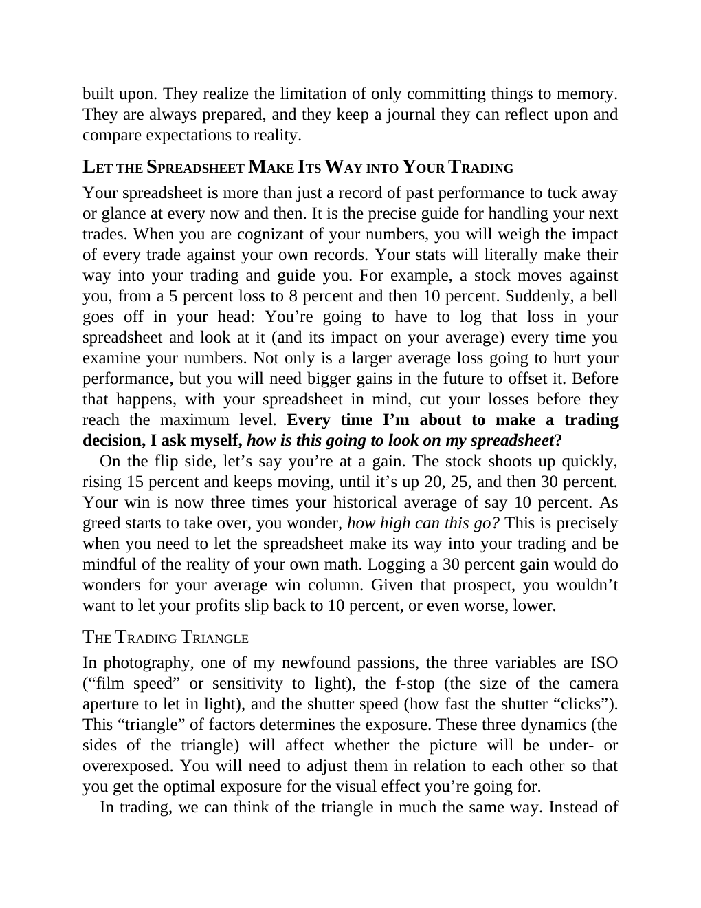

# Think and Trade Like a Champion - Page Image 69

## Source Page

Book: [[Think and Trade Like a Champion]]

## Page Read

Tags: text-or-context-page

Concepts: [[Mental Discipline]]

This page is mainly text/context. It is included so the image index has complete source coverage, but it should not be treated as an independent chart pattern.

## Linked Stock Figures

- No extracted stock-figure case on this page.

## Extracted Page Text Signal

built upon. They realize the limitation of only committing things to memory. They are always prepared, and they keep a journal they can reflect upon and compare expectations to reality. LET THE SPREADSHEET MAKE ITS WAY INTO YOUR TRADING Your spreadsheet is more than just a record of past performance to tuck away or glance at every now and then. It is the precise guide for handling your next trades. When you are cognizant of your numbers, you will weigh the impact of every trade against your own ...

## Manual Study Prompt

- What visual structure is the page trying to make obvious?
- Is the lesson about buying, avoiding, selling, or managing risk?
- If a ticker is not present, what generic behavior does the image teach?
- If a ticker is present, does the linked OHLCV rebuild confirm the same behavior?
