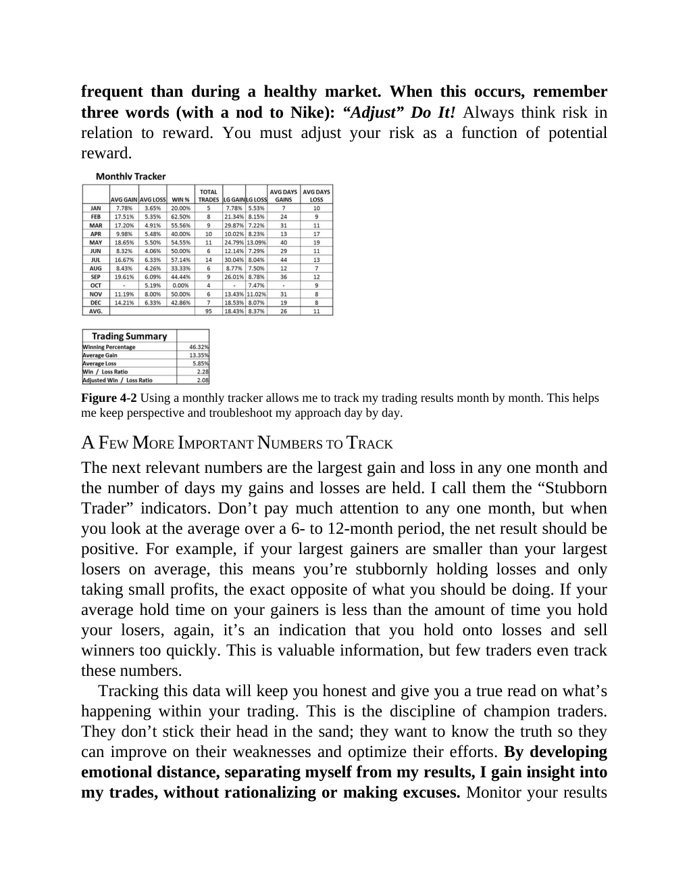

# Think and Trade Like a Champion - Page Image 71

## Source Page

Book: [[Think and Trade Like a Champion]]

## Page Read

Tags: manual-review-needed, mental-discipline, risk-first, sell-or-failure, stock-chart-page

Concepts: [[Mental Discipline]], [[Risk First]], [[Sell Rules and Failure Signals]]

This page contains one or more stock-chart figures already reconciled in the stock-image layer. Study the source page first for the visual lesson, then open the linked case notes to compare it against rebuilt OHLCV data.

## Linked Stock Figures

- [[Think and Trade Like a Champion - Figure 4-2 - manual-review - page 71]] - manual - manual-review-needed

## Extracted Page Text Signal

frequent than during a healthy market. When this occurs, remember three words (with a nod to Nike): “Adjust” Do It! Always think risk in relation to reward. You must adjust your risk as a function of potential reward. Figure 4-2 Using a monthly tracker allows me to track my trading results month by month. This helps me keep perspective and troubleshoot my approach day by day. A FEW MORE IMPORTANT NUMBERS TO TRACK The next relevant numbers are the largest gain and loss in any one month and the nu...

## Manual Study Prompt

- What visual structure is the page trying to make obvious?
- Is the lesson about buying, avoiding, selling, or managing risk?
- If a ticker is not present, what generic behavior does the image teach?
- If a ticker is present, does the linked OHLCV rebuild confirm the same behavior?
