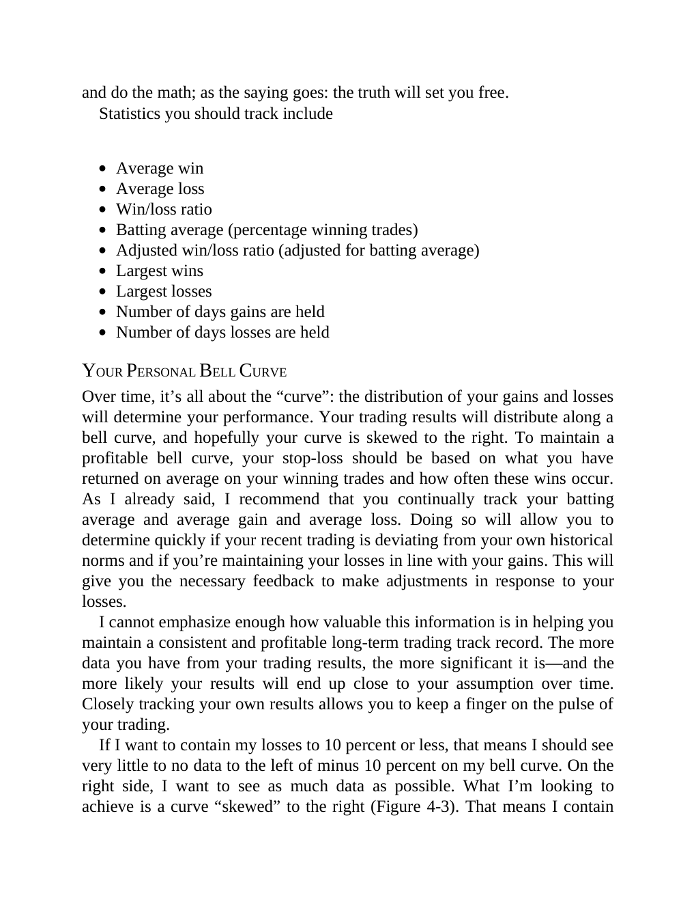

# Think and Trade Like a Champion - Page Image 72

## Source Page

Book: [[Think and Trade Like a Champion]]

## Page Read

Tags: risk-first, text-or-context-page

Concepts: [[Risk First]]

This page is mainly text/context. It is included so the image index has complete source coverage, but it should not be treated as an independent chart pattern.

## Linked Stock Figures

- No extracted stock-figure case on this page.

## Extracted Page Text Signal

and do the math; as the saying goes: the truth will set you free. Statistics you should track include Average win Average loss Win/loss ratio Batting average (percentage winning trades) Adjusted win/loss ratio (adjusted for batting average) Largest wins Largest losses Number of days gains are held Number of days losses are held YOUR PERSONAL BELL CURVE Over time, it’s all about the “curve”: the distribution of your gains and losses will determine your performance. Your trading results will distr...

## Manual Study Prompt

- What visual structure is the page trying to make obvious?
- Is the lesson about buying, avoiding, selling, or managing risk?
- If a ticker is not present, what generic behavior does the image teach?
- If a ticker is present, does the linked OHLCV rebuild confirm the same behavior?
