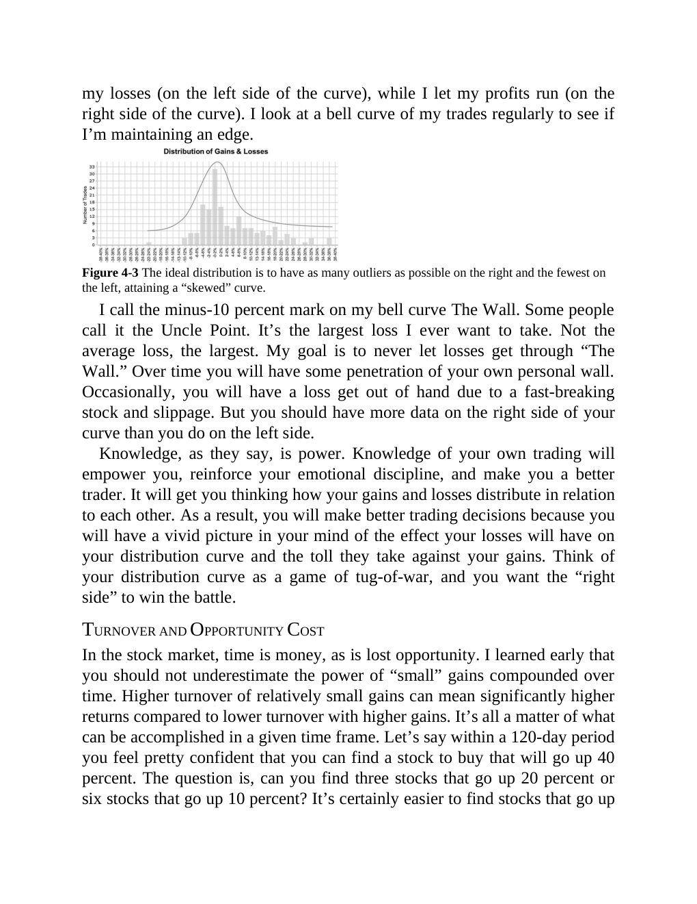

# Think and Trade Like a Champion - Page Image 73

## Source Page

Book: [[Think and Trade Like a Champion]]

## Page Read

Tags: manual-review-needed, mental-discipline, stock-chart-page

Concepts: [[Mental Discipline]]

This page contains one or more stock-chart figures already reconciled in the stock-image layer. Study the source page first for the visual lesson, then open the linked case notes to compare it against rebuilt OHLCV data.

## Linked Stock Figures

- [[Think and Trade Like a Champion - Figure 4-3 - manual-review - page 73]] - manual - manual-review-needed

## Extracted Page Text Signal

my losses (on the left side of the curve), while I let my profits run (on the right side of the curve). I look at a bell curve of my trades regularly to see if I’m maintaining an edge. Figure 4-3 The ideal distribution is to have as many outliers as possible on the right and the fewest on the left, attaining a “skewed” curve. I call the minus-10 percent mark on my bell curve The Wall. Some people call it the Uncle Point. It’s the largest loss I ever want to take. Not the average loss, the larges...

## Manual Study Prompt

- What visual structure is the page trying to make obvious?
- Is the lesson about buying, avoiding, selling, or managing risk?
- If a ticker is not present, what generic behavior does the image teach?
- If a ticker is present, does the linked OHLCV rebuild confirm the same behavior?
