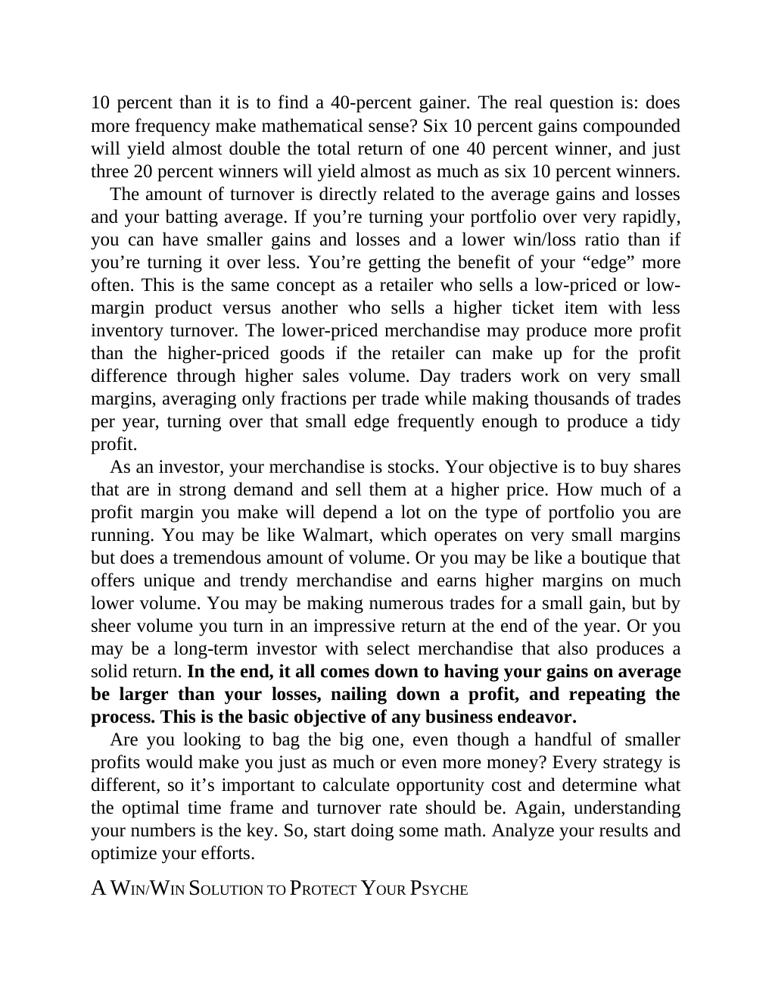

# Think and Trade Like a Champion - Page Image 74

## Source Page

Book: [[Think and Trade Like a Champion]]

## Page Read

Tags: sell-or-failure, text-or-context-page, volume-behavior

Concepts: [[Sell Rules and Failure Signals]], [[Volume Dry-Up and Accumulation]]

This page is mainly text/context. It is included so the image index has complete source coverage, but it should not be treated as an independent chart pattern.

## Linked Stock Figures

- No extracted stock-figure case on this page.

## Extracted Page Text Signal

10 percent than it is to find a 40-percent gainer. The real question is: does more frequency make mathematical sense? Six 10 percent gains compounded will yield almost double the total return of one 40 percent winner, and just three 20 percent winners will yield almost as much as six 10 percent winners. The amount of turnover is directly related to the average gains and losses and your batting average. If you’re turning your portfolio over very rapidly, you can have smaller gains and losses and ...

## Manual Study Prompt

- What visual structure is the page trying to make obvious?
- Is the lesson about buying, avoiding, selling, or managing risk?
- If a ticker is not present, what generic behavior does the image teach?
- If a ticker is present, does the linked OHLCV rebuild confirm the same behavior?
