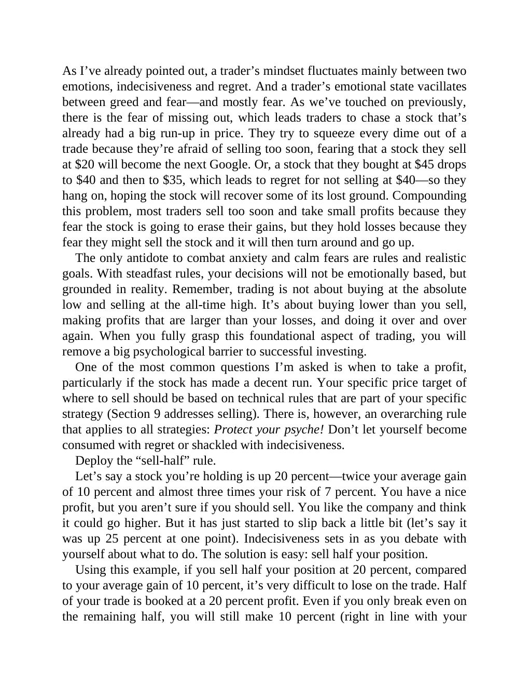

# Think and Trade Like a Champion - Page Image 75

## Source Page

Book: [[Think and Trade Like a Champion]]

## Page Read

Tags: sell-or-failure, text-or-context-page

Concepts: [[Sell Rules and Failure Signals]]

This page is mainly text/context. It is included so the image index has complete source coverage, but it should not be treated as an independent chart pattern.

## Linked Stock Figures

- No extracted stock-figure case on this page.

## Extracted Page Text Signal

As I’ve already pointed out, a trader’s mindset fluctuates mainly between two emotions, indecisiveness and regret. And a trader’s emotional state vacillates between greed and fear-and mostly fear. As we’ve touched on previously, there is the fear of missing out, which leads traders to chase a stock that’s already had a big run-up in price. They try to squeeze every dime out of a trade because they’re afraid of selling too soon, fearing that a stock they sell at $20 will become the next Google. O...

## Manual Study Prompt

- What visual structure is the page trying to make obvious?
- Is the lesson about buying, avoiding, selling, or managing risk?
- If a ticker is not present, what generic behavior does the image teach?
- If a ticker is present, does the linked OHLCV rebuild confirm the same behavior?
