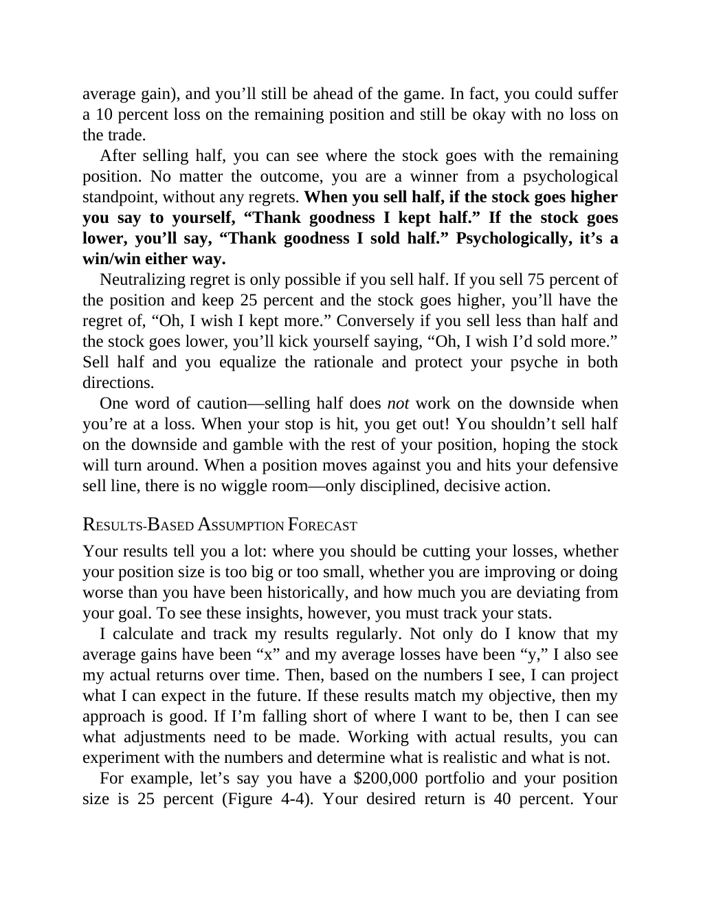

# Think and Trade Like a Champion - Page Image 76

## Source Page

Book: [[Think and Trade Like a Champion]]

## Page Read

Tags: mental-discipline, risk-first, sell-or-failure, text-or-context-page

Concepts: [[Mental Discipline]], [[Risk First]], [[Sell Rules and Failure Signals]]

This page is mainly text/context. It is included so the image index has complete source coverage, but it should not be treated as an independent chart pattern.

## Linked Stock Figures

- No extracted stock-figure case on this page.

## Extracted Page Text Signal

average gain), and you’ll still be ahead of the game. In fact, you could suffer a 10 percent loss on the remaining position and still be okay with no loss on the trade. After selling half, you can see where the stock goes with the remaining position. No matter the outcome, you are a winner from a psychological standpoint, without any regrets. When you sell half, if the stock goes higher you say to yourself, “Thank goodness I kept half.” If the stock goes lower, you’ll say, “Thank goodness I sold...

## Manual Study Prompt

- What visual structure is the page trying to make obvious?
- Is the lesson about buying, avoiding, selling, or managing risk?
- If a ticker is not present, what generic behavior does the image teach?
- If a ticker is present, does the linked OHLCV rebuild confirm the same behavior?
