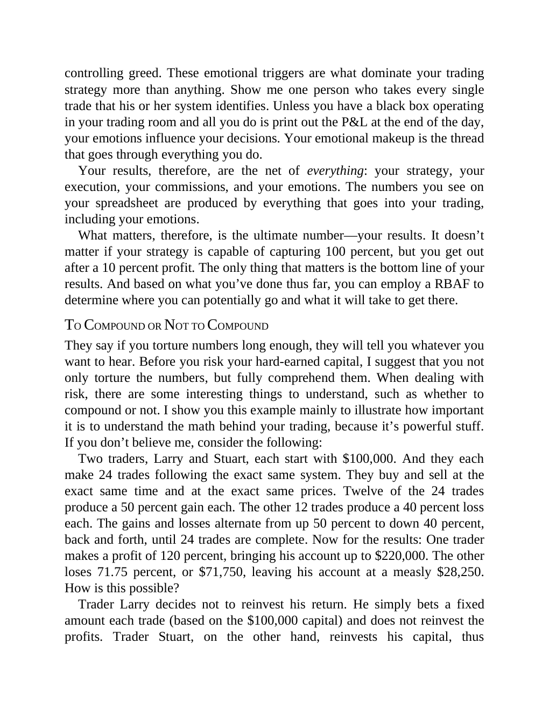

# Think and Trade Like a Champion - Page Image 78

## Source Page

Book: [[Think and Trade Like a Champion]]

## Page Read

Tags: risk-first, text-or-context-page

Concepts: [[Risk First]]

This page is mainly text/context. It is included so the image index has complete source coverage, but it should not be treated as an independent chart pattern.

## Linked Stock Figures

- No extracted stock-figure case on this page.

## Extracted Page Text Signal

controlling greed. These emotional triggers are what dominate your trading strategy more than anything. Show me one person who takes every single trade that his or her system identifies. Unless you have a black box operating in your trading room and all you do is print out the P&L at the end of the day, your emotions influence your decisions. Your emotional makeup is the thread that goes through everything you do. Your results, therefore, are the net of everything: your strategy, your execution,...

## Manual Study Prompt

- What visual structure is the page trying to make obvious?
- Is the lesson about buying, avoiding, selling, or managing risk?
- If a ticker is not present, what generic behavior does the image teach?
- If a ticker is present, does the linked OHLCV rebuild confirm the same behavior?
