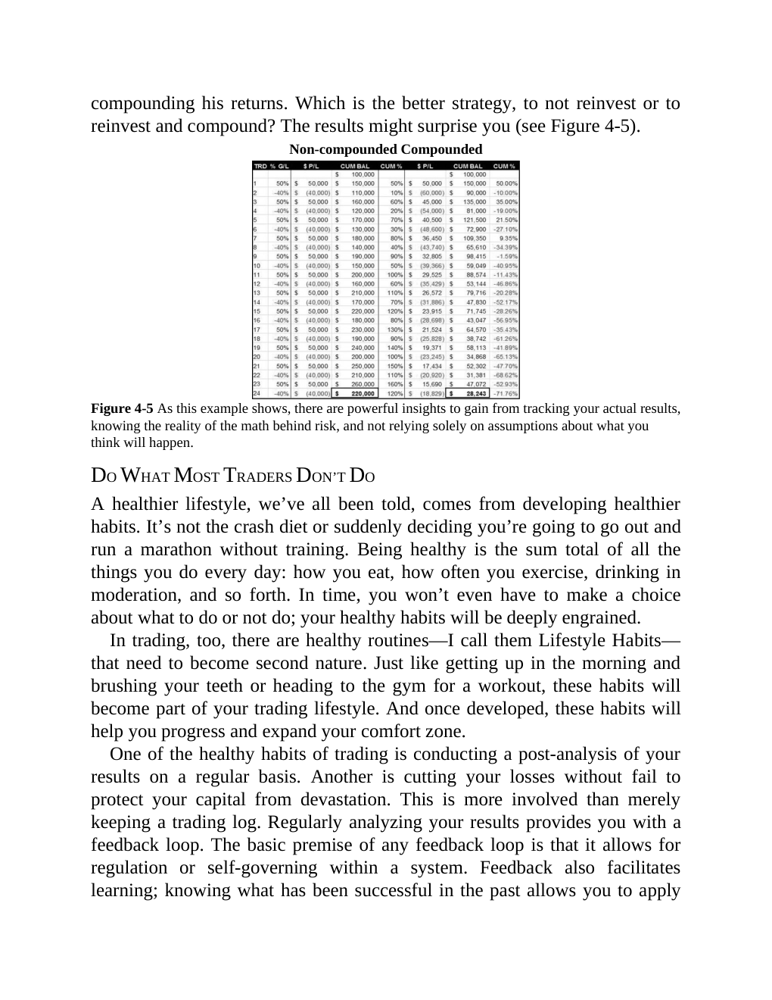

# Think and Trade Like a Champion - Page Image 79

## Source Page

Book: [[Think and Trade Like a Champion]]

## Page Read

Tags: manual-review-needed, risk-first, stock-chart-page

Concepts: [[Mental Discipline]], [[Risk First]]

This page contains one or more stock-chart figures already reconciled in the stock-image layer. Study the source page first for the visual lesson, then open the linked case notes to compare it against rebuilt OHLCV data.

## Linked Stock Figures

- [[Think and Trade Like a Champion - Figure 4-5 - manual-review - page 79]] - manual - manual-review-needed

## Extracted Page Text Signal

compounding his returns. Which is the better strategy, to not reinvest or to reinvest and compound? The results might surprise you (see Figure 4-5). Non-compounded Compounded Figure 4-5 As this example shows, there are powerful insights to gain from tracking your actual results, knowing the reality of the math behind risk, and not relying solely on assumptions about what you think will happen. DO WHAT MOST TRADERS DON’T DO A healthier lifestyle, we’ve all been told, comes from developing healthi...

## Manual Study Prompt

- What visual structure is the page trying to make obvious?
- Is the lesson about buying, avoiding, selling, or managing risk?
- If a ticker is not present, what generic behavior does the image teach?
- If a ticker is present, does the linked OHLCV rebuild confirm the same behavior?
