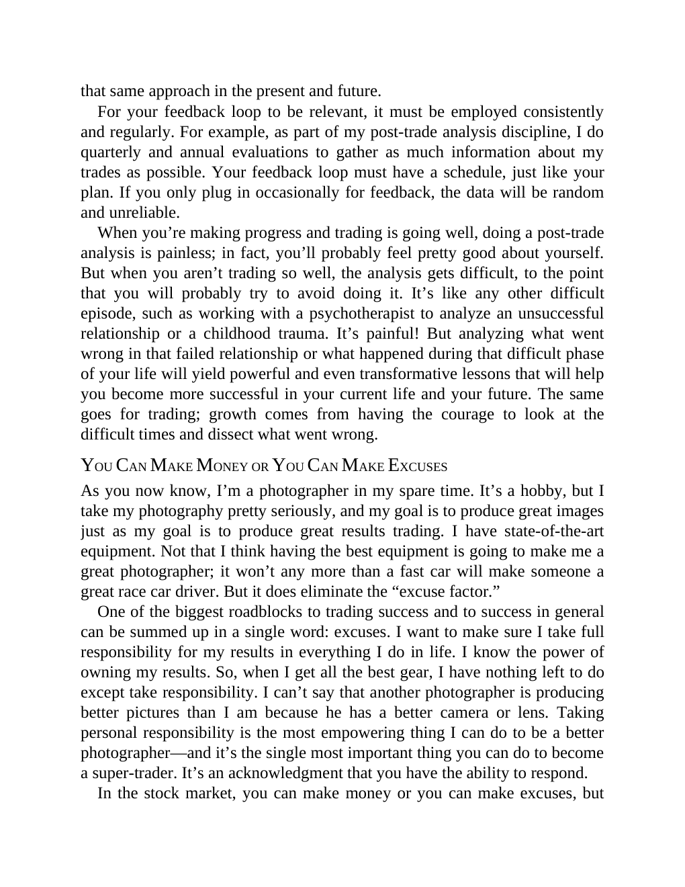

# Think and Trade Like a Champion - Page Image 80

## Source Page

Book: [[Think and Trade Like a Champion]]

## Page Read

Tags: mental-discipline, text-or-context-page

Concepts: [[Mental Discipline]]

This page is mainly text/context. It is included so the image index has complete source coverage, but it should not be treated as an independent chart pattern.

## Linked Stock Figures

- No extracted stock-figure case on this page.

## Extracted Page Text Signal

that same approach in the present and future. For your feedback loop to be relevant, it must be employed consistently and regularly. For example, as part of my post-trade analysis discipline, I do quarterly and annual evaluations to gather as much information about my trades as possible. Your feedback loop must have a schedule, just like your plan. If you only plug in occasionally for feedback, the data will be random and unreliable. When you’re making progress and trading is going well, doing a...

## Manual Study Prompt

- What visual structure is the page trying to make obvious?
- Is the lesson about buying, avoiding, selling, or managing risk?
- If a ticker is not present, what generic behavior does the image teach?
- If a ticker is present, does the linked OHLCV rebuild confirm the same behavior?
