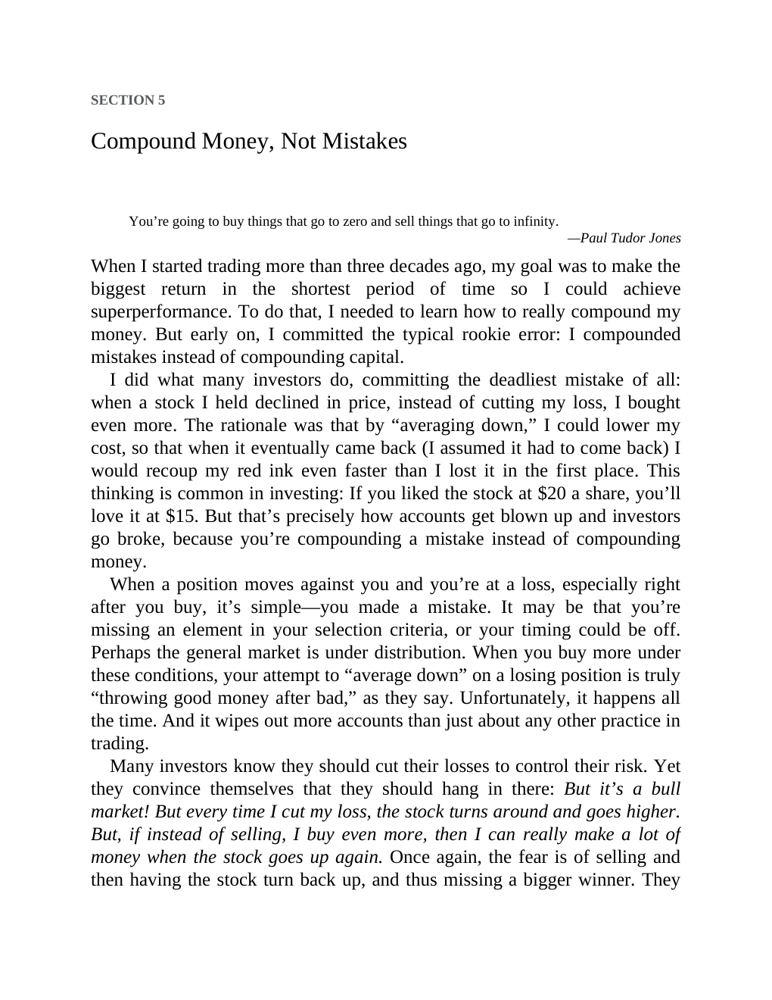

# Think and Trade Like a Champion - Page Image 82

## Source Page

Book: [[Think and Trade Like a Champion]]

## Page Read

Tags: mental-discipline, sell-or-failure, text-or-context-page

Concepts: [[Mental Discipline]], [[Sell Rules and Failure Signals]]

This page is mainly text/context. It is included so the image index has complete source coverage, but it should not be treated as an independent chart pattern.

## Linked Stock Figures

- No extracted stock-figure case on this page.

## Extracted Page Text Signal

SECTION 5 Compound Money, Not Mistakes You’re going to buy things that go to zero and sell things that go to infinity. -Paul Tudor Jones When I started trading more than three decades ago, my goal was to make the biggest return in the shortest period of time so I could achieve superperformance. To do that, I needed to learn how to really compound my money. But early on, I committed the typical rookie error: I compounded mistakes instead of compounding capital. I did what many investors do, commi...

## Manual Study Prompt

- What visual structure is the page trying to make obvious?
- Is the lesson about buying, avoiding, selling, or managing risk?
- If a ticker is not present, what generic behavior does the image teach?
- If a ticker is present, does the linked OHLCV rebuild confirm the same behavior?
