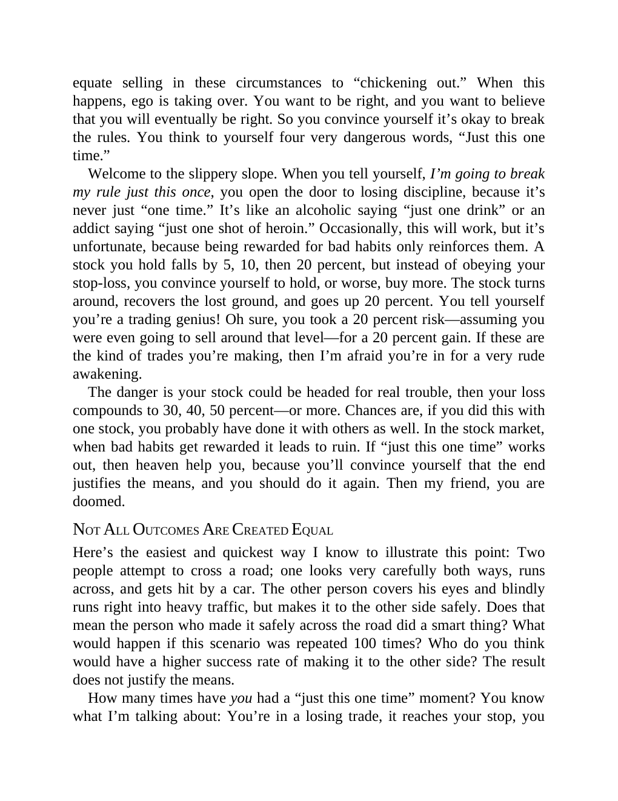

# Think and Trade Like a Champion - Page Image 83

## Source Page

Book: [[Think and Trade Like a Champion]]

## Page Read

Tags: mental-discipline, risk-first, sell-or-failure, text-or-context-page

Concepts: [[Mental Discipline]], [[Risk First]], [[Sell Rules and Failure Signals]]

This page is mainly text/context. It is included so the image index has complete source coverage, but it should not be treated as an independent chart pattern.

## Linked Stock Figures

- No extracted stock-figure case on this page.

## Extracted Page Text Signal

equate selling in these circumstances to “chickening out.” When this happens, ego is taking over. You want to be right, and you want to believe that you will eventually be right. So you convince yourself it’s okay to break the rules. You think to yourself four very dangerous words, “Just this one time.” Welcome to the slippery slope. When you tell yourself, I’m going to break my rule just this once, you open the door to losing discipline, because it’s never just “one time.” It’s like an alcoholi...

## Manual Study Prompt

- What visual structure is the page trying to make obvious?
- Is the lesson about buying, avoiding, selling, or managing risk?
- If a ticker is not present, what generic behavior does the image teach?
- If a ticker is present, does the linked OHLCV rebuild confirm the same behavior?
