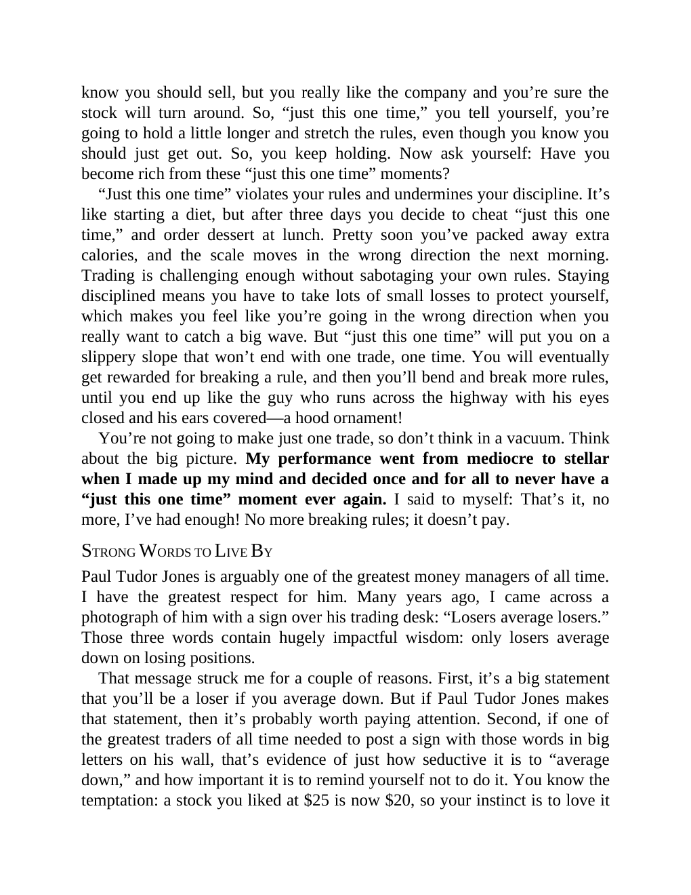

# Think and Trade Like a Champion - Page Image 84

## Source Page

Book: [[Think and Trade Like a Champion]]

## Page Read

Tags: mental-discipline, sell-or-failure, text-or-context-page

Concepts: [[Mental Discipline]], [[Sell Rules and Failure Signals]]

This page is mainly text/context. It is included so the image index has complete source coverage, but it should not be treated as an independent chart pattern.

## Linked Stock Figures

- No extracted stock-figure case on this page.

## Extracted Page Text Signal

know you should sell, but you really like the company and you’re sure the stock will turn around. So, “just this one time,” you tell yourself, you’re going to hold a little longer and stretch the rules, even though you know you should just get out. So, you keep holding. Now ask yourself: Have you become rich from these “just this one time” moments? “Just this one time” violates your rules and undermines your discipline. It’s like starting a diet, but after three days you decide to cheat “just th...

## Manual Study Prompt

- What visual structure is the page trying to make obvious?
- Is the lesson about buying, avoiding, selling, or managing risk?
- If a ticker is not present, what generic behavior does the image teach?
- If a ticker is present, does the linked OHLCV rebuild confirm the same behavior?
