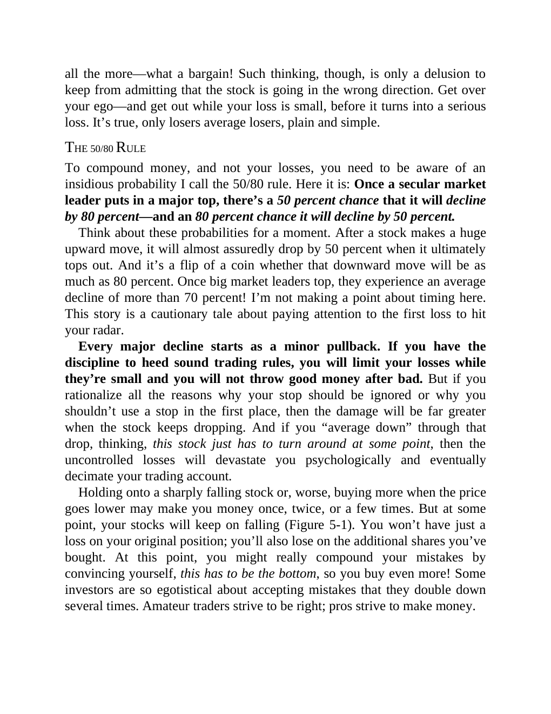

# Think and Trade Like a Champion - Page Image 85

## Source Page

Book: [[Think and Trade Like a Champion]]

## Page Read

Tags: mental-discipline, risk-first, text-or-context-page

Concepts: [[Mental Discipline]], [[Risk First]]

This page is mainly text/context. It is included so the image index has complete source coverage, but it should not be treated as an independent chart pattern.

## Linked Stock Figures

- No extracted stock-figure case on this page.

## Extracted Page Text Signal

all the more-what a bargain! Such thinking, though, is only a delusion to keep from admitting that the stock is going in the wrong direction. Get over your ego-and get out while your loss is small, before it turns into a serious loss. It’s true, only losers average losers, plain and simple. THE 50/80 RULE To compound money, and not your losses, you need to be aware of an insidious probability I call the 50/80 rule. Here it is: Once a secular market leader puts in a major top, there’s a 50 percen...

## Manual Study Prompt

- What visual structure is the page trying to make obvious?
- Is the lesson about buying, avoiding, selling, or managing risk?
- If a ticker is not present, what generic behavior does the image teach?
- If a ticker is present, does the linked OHLCV rebuild confirm the same behavior?
