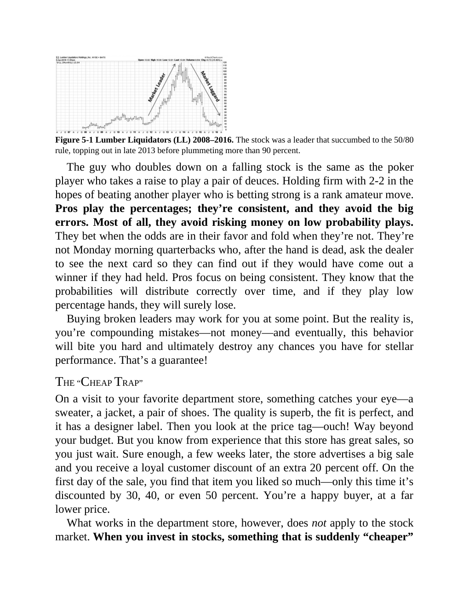

# Think and Trade Like a Champion - Page Image 86

## Source Page

Book: [[Think and Trade Like a Champion]]

## Page Read

Tags: manual-review-needed, mental-discipline, risk-first, stock-chart-page

Concepts: [[Mental Discipline]], [[Risk First]]

This page contains one or more stock-chart figures already reconciled in the stock-image layer. Study the source page first for the visual lesson, then open the linked case notes to compare it against rebuilt OHLCV data.

## Linked Stock Figures

- [[Think and Trade Like a Champion - Figure 5-1 - LL - page 86]] - LL - manual-review-needed

## Extracted Page Text Signal

Figure 5-1 Lumber Liquidators (LL) 2008-2016. The stock was a leader that succumbed to the 50/80 rule, topping out in late 2013 before plummeting more than 90 percent. The guy who doubles down on a falling stock is the same as the poker player who takes a raise to play a pair of deuces. Holding firm with 2-2 in the hopes of beating another player who is betting strong is a rank amateur move. Pros play the percentages; they’re consistent, and they avoid the big errors. Most of all, they avoid ris...

## Manual Study Prompt

- What visual structure is the page trying to make obvious?
- Is the lesson about buying, avoiding, selling, or managing risk?
- If a ticker is not present, what generic behavior does the image teach?
- If a ticker is present, does the linked OHLCV rebuild confirm the same behavior?
