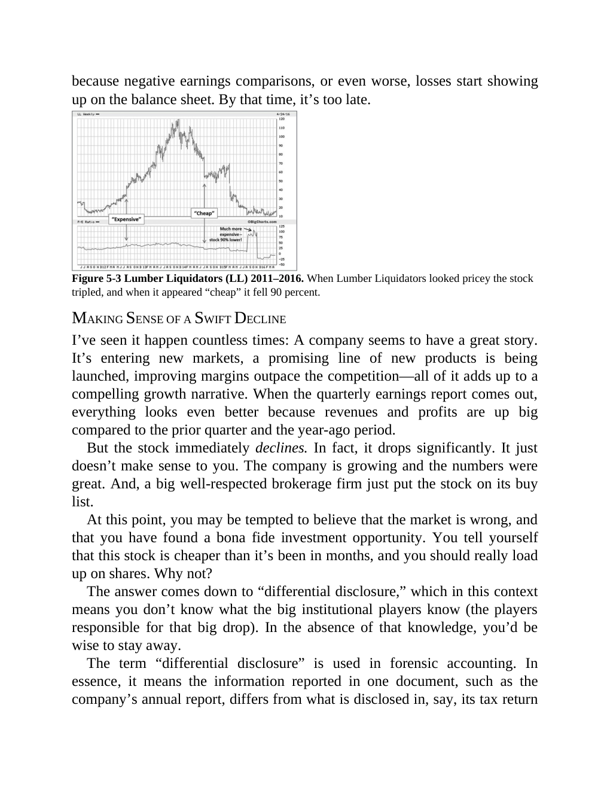

# Think and Trade Like a Champion - Page Image 88

## Source Page

Book: [[Think and Trade Like a Champion]]

## Page Read

Tags: manual-review-needed, stock-chart-page

Concepts: [[Mental Discipline]]

This page contains one or more stock-chart figures already reconciled in the stock-image layer. Study the source page first for the visual lesson, then open the linked case notes to compare it against rebuilt OHLCV data.

## Linked Stock Figures

- [[Think and Trade Like a Champion - Figure 5-3 - LL - page 88]] - LL - manual-review-needed

## Extracted Page Text Signal

because negative earnings comparisons, or even worse, losses start showing up on the balance sheet. By that time, it’s too late. Figure 5-3 Lumber Liquidators (LL) 2011-2016. When Lumber Liquidators looked pricey the stock tripled, and when it appeared “cheap” it fell 90 percent. MAKING SENSE OF A SWIFT DECLINE I’ve seen it happen countless times: A company seems to have a great story. It’s entering new markets, a promising line of new products is being launched, improving margins outpace the co...

## Manual Study Prompt

- What visual structure is the page trying to make obvious?
- Is the lesson about buying, avoiding, selling, or managing risk?
- If a ticker is not present, what generic behavior does the image teach?
- If a ticker is present, does the linked OHLCV rebuild confirm the same behavior?
