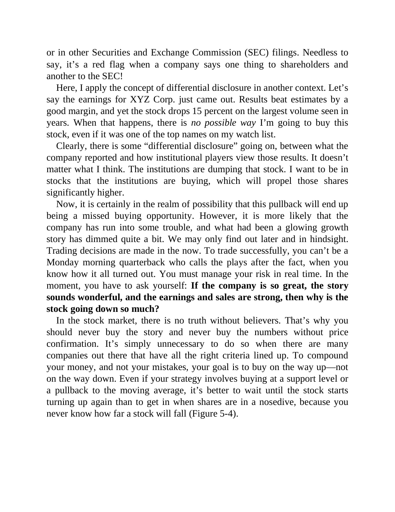

# Think and Trade Like a Champion - Page Image 89

## Source Page

Book: [[Think and Trade Like a Champion]]

## Page Read

Tags: risk-first, text-or-context-page, volume-behavior

Concepts: [[Risk First]], [[Volume Dry-Up and Accumulation]]

This page is mainly text/context. It is included so the image index has complete source coverage, but it should not be treated as an independent chart pattern.

## Linked Stock Figures

- No extracted stock-figure case on this page.

## Extracted Page Text Signal

or in other Securities and Exchange Commission (SEC) filings. Needless to say, it’s a red flag when a company says one thing to shareholders and another to the SEC! Here, I apply the concept of differential disclosure in another context. Let’s say the earnings for XYZ Corp. just came out. Results beat estimates by a good margin, and yet the stock drops 15 percent on the largest volume seen in years. When that happens, there is no possible way I’m going to buy this stock, even if it was one of th...

## Manual Study Prompt

- What visual structure is the page trying to make obvious?
- Is the lesson about buying, avoiding, selling, or managing risk?
- If a ticker is not present, what generic behavior does the image teach?
- If a ticker is present, does the linked OHLCV rebuild confirm the same behavior?
