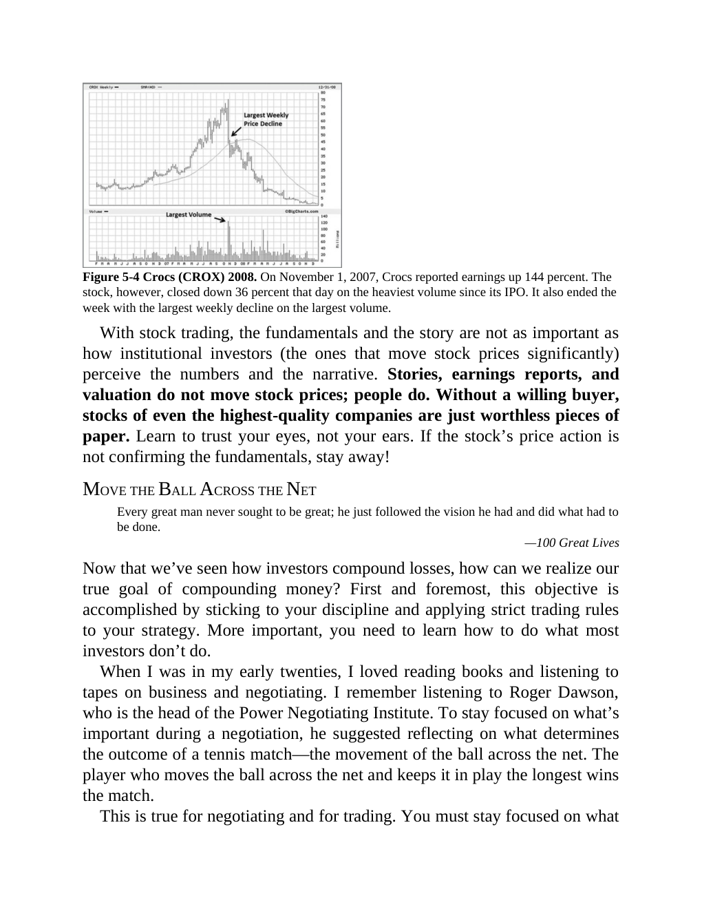

# Think and Trade Like a Champion - Page Image 90

## Source Page

Book: [[Think and Trade Like a Champion]]

## Page Read

Tags: failed-breakout-or-stage-4, ipo-base, ipo-or-new-issue, mental-discipline, stock-chart-page, volume-behavior

Concepts: [[IPO Base New Issue Setup|IPO Base / New Issue Setup]], [[Mental Discipline]], [[Risk First]], [[Sell Rules and Failure Signals]], [[Trend Template]], [[Volume Dry-Up and Accumulation]]

This page contains one or more stock-chart figures already reconciled in the stock-image layer. Study the source page first for the visual lesson, then open the linked case notes to compare it against rebuilt OHLCV data.

## Linked Stock Figures

- [[Think and Trade Like a Champion - Figure 5-4 - CROX - page 90]] - CROX - ipo-base; failed-breakout-or-stage-4

## Extracted Page Text Signal

Figure 5-4 Crocs (CROX) 2008. On November 1, 2007, Crocs reported earnings up 144 percent. The stock, however, closed down 36 percent that day on the heaviest volume since its IPO. It also ended the week with the largest weekly decline on the largest volume. With stock trading, the fundamentals and the story are not as important as how institutional investors (the ones that move stock prices significantly) perceive the numbers and the narrative. Stories, earnings reports, and valuation do not mo...

## Manual Study Prompt

- What visual structure is the page trying to make obvious?
- Is the lesson about buying, avoiding, selling, or managing risk?
- If a ticker is not present, what generic behavior does the image teach?
- If a ticker is present, does the linked OHLCV rebuild confirm the same behavior?
