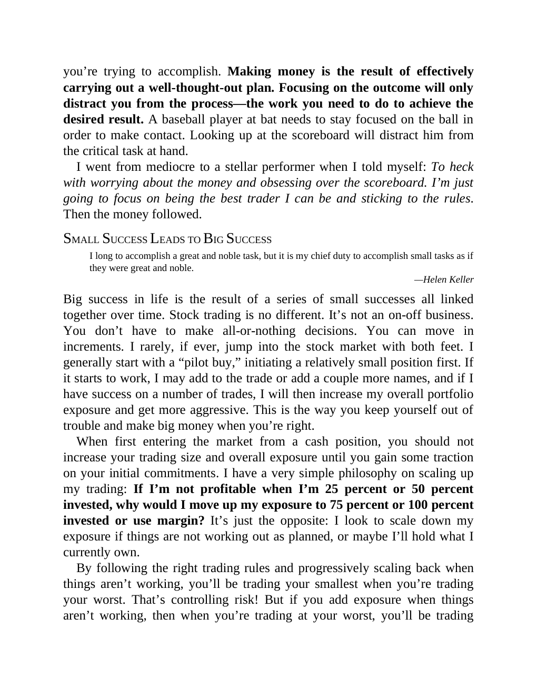

# Think and Trade Like a Champion - Page Image 91

## Source Page

Book: [[Think and Trade Like a Champion]]

## Page Read

Tags: text-or-context-page

Concepts: [[Mental Discipline]]

This page is mainly text/context. It is included so the image index has complete source coverage, but it should not be treated as an independent chart pattern.

## Linked Stock Figures

- No extracted stock-figure case on this page.

## Extracted Page Text Signal

you’re trying to accomplish. Making money is the result of effectively carrying out a well-thought-out plan. Focusing on the outcome will only distract you from the process-the work you need to do to achieve the desired result. A baseball player at bat needs to stay focused on the ball in order to make contact. Looking up at the scoreboard will distract him from the critical task at hand. I went from mediocre to a stellar performer when I told myself: To heck with worrying about the money and ob...

## Manual Study Prompt

- What visual structure is the page trying to make obvious?
- Is the lesson about buying, avoiding, selling, or managing risk?
- If a ticker is not present, what generic behavior does the image teach?
- If a ticker is present, does the linked OHLCV rebuild confirm the same behavior?
