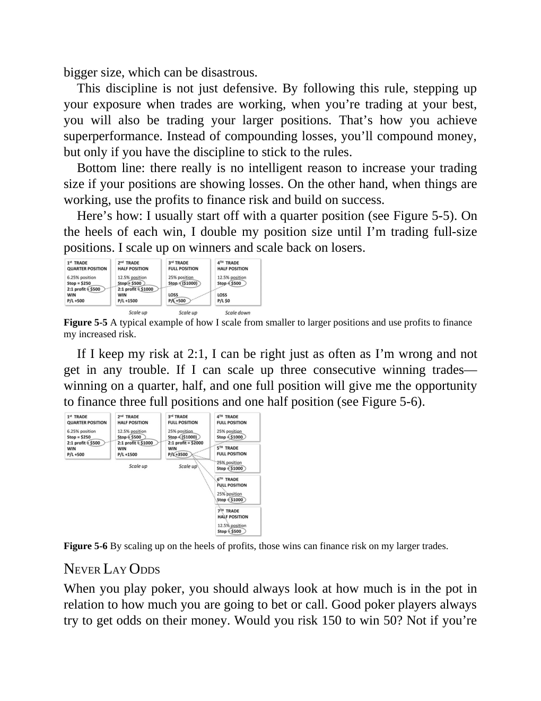

# Think and Trade Like a Champion - Page Image 92

## Source Page

Book: [[Think and Trade Like a Champion]]

## Page Read

Tags: manual-review-needed, mental-discipline, risk-first, stock-chart-page

Concepts: [[Mental Discipline]], [[Risk First]]

This page contains one or more stock-chart figures already reconciled in the stock-image layer. Study the source page first for the visual lesson, then open the linked case notes to compare it against rebuilt OHLCV data.

## Linked Stock Figures

- [[Think and Trade Like a Champion - Figure 5-5 - manual-review - page 92]] - manual - manual-review-needed
- [[Think and Trade Like a Champion - Figure 5-6 - manual-review - page 92]] - manual - manual-review-needed

## Extracted Page Text Signal

bigger size, which can be disastrous. This discipline is not just defensive. By following this rule, stepping up your exposure when trades are working, when you’re trading at your best, you will also be trading your larger positions. That’s how you achieve superperformance. Instead of compounding losses, you’ll compound money, but only if you have the discipline to stick to the rules. Bottom line: there really is no intelligent reason to increase your trading size if your positions are showing l...

## Manual Study Prompt

- What visual structure is the page trying to make obvious?
- Is the lesson about buying, avoiding, selling, or managing risk?
- If a ticker is not present, what generic behavior does the image teach?
- If a ticker is present, does the linked OHLCV rebuild confirm the same behavior?
