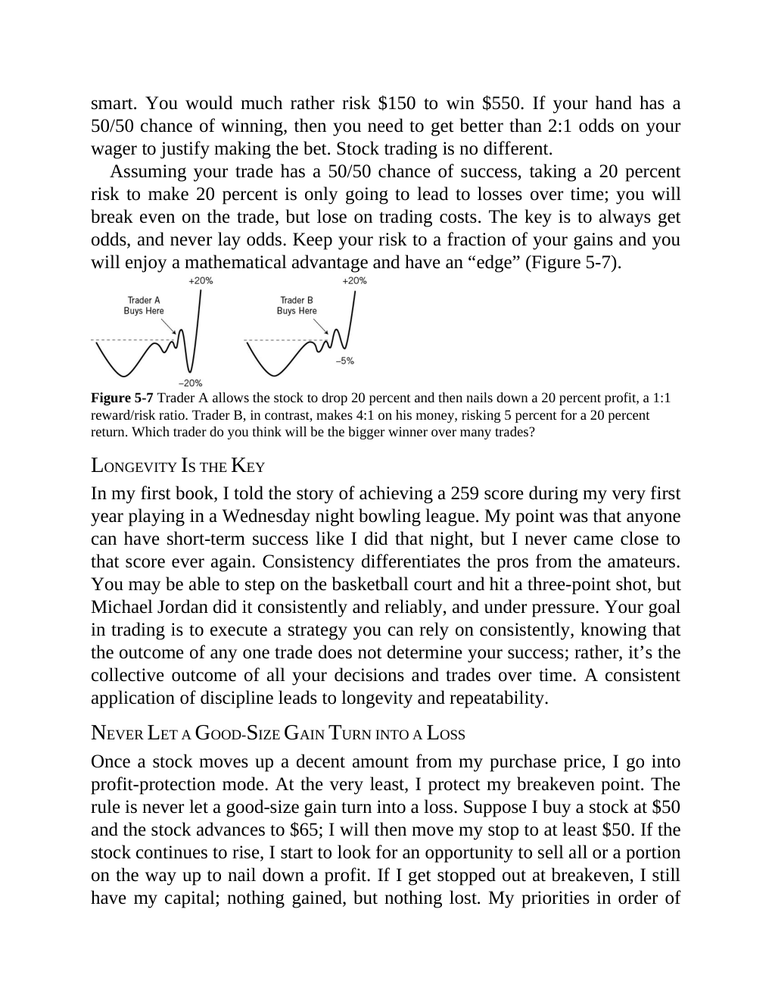

# Think and Trade Like a Champion - Page Image 93

## Source Page

Book: [[Think and Trade Like a Champion]]

## Page Read

Tags: manual-review-needed, risk-first, stock-chart-page

Concepts: [[Mental Discipline]], [[Risk First]]

This page contains one or more stock-chart figures already reconciled in the stock-image layer. Study the source page first for the visual lesson, then open the linked case notes to compare it against rebuilt OHLCV data.

## Linked Stock Figures

- [[Think and Trade Like a Champion - Figure 5-7 - manual-review - page 93]] - manual - manual-review-needed

## Extracted Page Text Signal

smart. You would much rather risk $150 to win $550. If your hand has a 50/50 chance of winning, then you need to get better than 2:1 odds on your wager to justify making the bet. Stock trading is no different. Assuming your trade has a 50/50 chance of success, taking a 20 percent risk to make 20 percent is only going to lead to losses over time; you will break even on the trade, but lose on trading costs. The key is to always get odds, and never lay odds. Keep your risk to a fraction of your gai...

## Manual Study Prompt

- What visual structure is the page trying to make obvious?
- Is the lesson about buying, avoiding, selling, or managing risk?
- If a ticker is not present, what generic behavior does the image teach?
- If a ticker is present, does the linked OHLCV rebuild confirm the same behavior?
