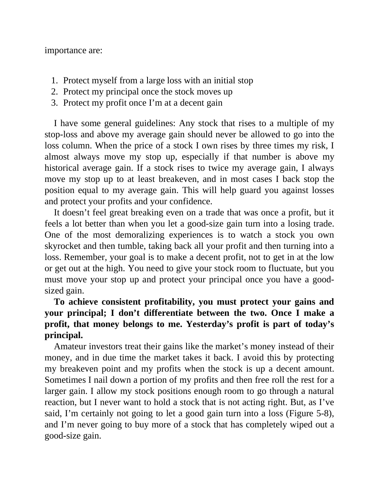

# Think and Trade Like a Champion - Page Image 94

## Source Page

Book: [[Think and Trade Like a Champion]]

## Page Read

Tags: risk-first, text-or-context-page

Concepts: [[Risk First]]

This page is mainly text/context. It is included so the image index has complete source coverage, but it should not be treated as an independent chart pattern.

## Linked Stock Figures

- No extracted stock-figure case on this page.

## Extracted Page Text Signal

importance are: 1. Protect myself from a large loss with an initial stop 2. Protect my principal once the stock moves up 3. Protect my profit once I’m at a decent gain I have some general guidelines: Any stock that rises to a multiple of my stop-loss and above my average gain should never be allowed to go into the loss column. When the price of a stock I own rises by three times my risk, I almost always move my stop up, especially if that number is above my historical average gain. If a stock ri...

## Manual Study Prompt

- What visual structure is the page trying to make obvious?
- Is the lesson about buying, avoiding, selling, or managing risk?
- If a ticker is not present, what generic behavior does the image teach?
- If a ticker is present, does the linked OHLCV rebuild confirm the same behavior?
