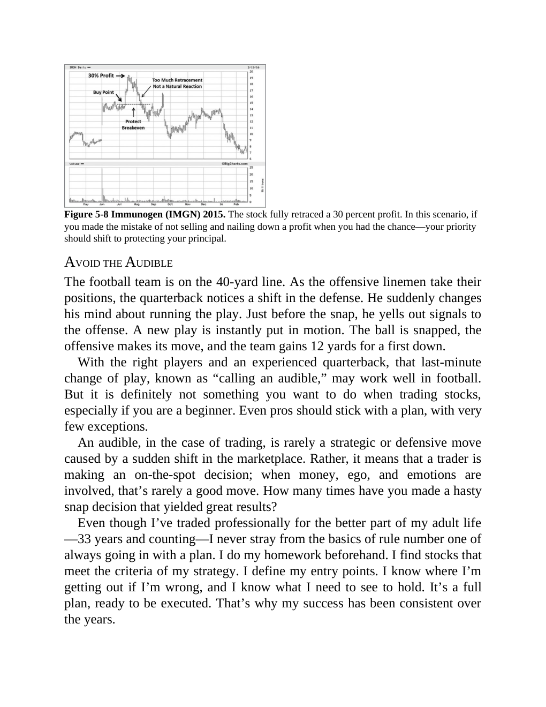

# Think and Trade Like a Champion - Page Image 95

## Source Page

Book: [[Think and Trade Like a Champion]]

## Page Read

Tags: manual-review-needed, mental-discipline, sell-or-failure, stock-chart-page

Concepts: [[Mental Discipline]], [[Sell Rules and Failure Signals]]

This page contains one or more stock-chart figures already reconciled in the stock-image layer. Study the source page first for the visual lesson, then open the linked case notes to compare it against rebuilt OHLCV data.

## Linked Stock Figures

- [[Think and Trade Like a Champion - Figure 5-8 - IMGN - page 95]] - IMGN - manual-review-needed

## Extracted Page Text Signal

Figure 5-8 Immunogen (IMGN) 2015. The stock fully retraced a 30 percent profit. In this scenario, if you made the mistake of not selling and nailing down a profit when you had the chance-your priority should shift to protecting your principal. AVOID THE AUDIBLE The football team is on the 40-yard line. As the offensive linemen take their positions, the quarterback notices a shift in the defense. He suddenly changes his mind about running the play. Just before the snap, he yells out signals to th...

## Manual Study Prompt

- What visual structure is the page trying to make obvious?
- Is the lesson about buying, avoiding, selling, or managing risk?
- If a ticker is not present, what generic behavior does the image teach?
- If a ticker is present, does the linked OHLCV rebuild confirm the same behavior?
