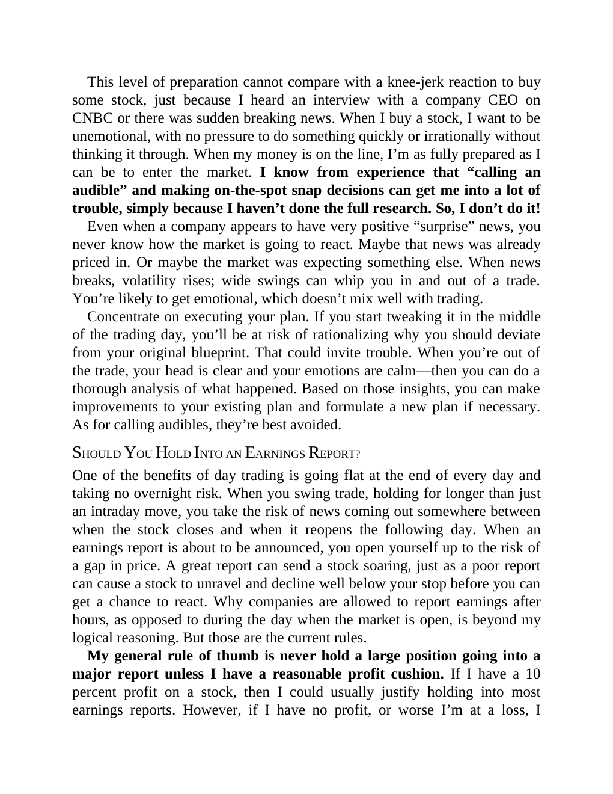

# Think and Trade Like a Champion - Page Image 96

## Source Page

Book: [[Think and Trade Like a Champion]]

## Page Read

Tags: risk-first, text-or-context-page

Concepts: [[Risk First]]

This page is mainly text/context. It is included so the image index has complete source coverage, but it should not be treated as an independent chart pattern.

## Linked Stock Figures

- No extracted stock-figure case on this page.

## Extracted Page Text Signal

This level of preparation cannot compare with a knee-jerk reaction to buy some stock, just because I heard an interview with a company CEO on CNBC or there was sudden breaking news. When I buy a stock, I want to be unemotional, with no pressure to do something quickly or irrationally without thinking it through. When my money is on the line, I’m as fully prepared as I can be to enter the market. I know from experience that “calling an audible” and making on-the-spot snap decisions can get me int...

## Manual Study Prompt

- What visual structure is the page trying to make obvious?
- Is the lesson about buying, avoiding, selling, or managing risk?
- If a ticker is not present, what generic behavior does the image teach?
- If a ticker is present, does the linked OHLCV rebuild confirm the same behavior?
