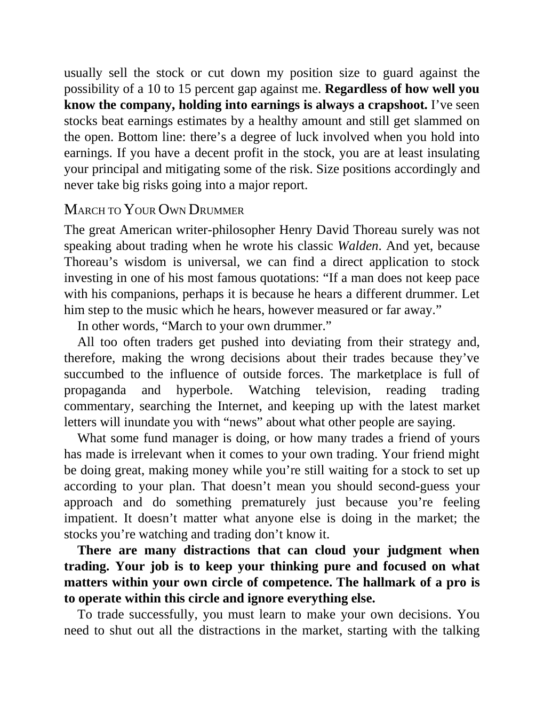

# Think and Trade Like a Champion - Page Image 97

## Source Page

Book: [[Think and Trade Like a Champion]]

## Page Read

Tags: risk-first, sell-or-failure, text-or-context-page

Concepts: [[Risk First]], [[Sell Rules and Failure Signals]]

This page is mainly text/context. It is included so the image index has complete source coverage, but it should not be treated as an independent chart pattern.

## Linked Stock Figures

- No extracted stock-figure case on this page.

## Extracted Page Text Signal

usually sell the stock or cut down my position size to guard against the possibility of a 10 to 15 percent gap against me. Regardless of how well you know the company, holding into earnings is always a crapshoot. I’ve seen stocks beat earnings estimates by a healthy amount and still get slammed on the open. Bottom line: there’s a degree of luck involved when you hold into earnings. If you have a decent profit in the stock, you are at least insulating your principal and mitigating some of the ris...

## Manual Study Prompt

- What visual structure is the page trying to make obvious?
- Is the lesson about buying, avoiding, selling, or managing risk?
- If a ticker is not present, what generic behavior does the image teach?
- If a ticker is present, does the linked OHLCV rebuild confirm the same behavior?
