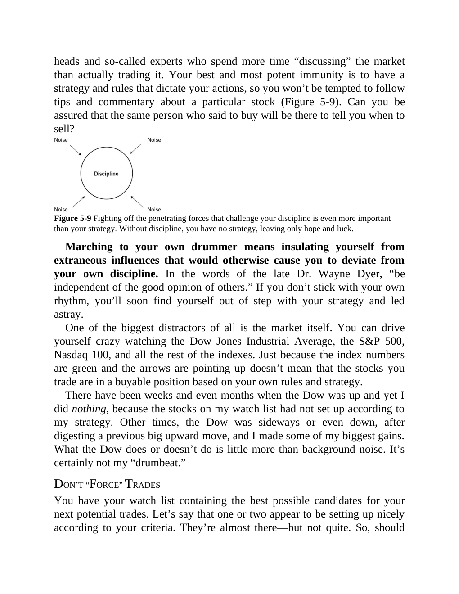

# Think and Trade Like a Champion - Page Image 98

## Source Page

Book: [[Think and Trade Like a Champion]]

## Page Read

Tags: manual-review-needed, mental-discipline, sell-or-failure, stock-chart-page

Concepts: [[Mental Discipline]], [[Sell Rules and Failure Signals]]

This page contains one or more stock-chart figures already reconciled in the stock-image layer. Study the source page first for the visual lesson, then open the linked case notes to compare it against rebuilt OHLCV data.

## Linked Stock Figures

- [[Think and Trade Like a Champion - Figure 5-9 - manual-review - page 98]] - manual - manual-review-needed

## Extracted Page Text Signal

heads and so-called experts who spend more time “discussing” the market than actually trading it. Your best and most potent immunity is to have a strategy and rules that dictate your actions, so you won’t be tempted to follow tips and commentary about a particular stock (Figure 5-9). Can you be assured that the same person who said to buy will be there to tell you when to sell? Figure 5-9 Fighting off the penetrating forces that challenge your discipline is even more important than your strategy...

## Manual Study Prompt

- What visual structure is the page trying to make obvious?
- Is the lesson about buying, avoiding, selling, or managing risk?
- If a ticker is not present, what generic behavior does the image teach?
- If a ticker is present, does the linked OHLCV rebuild confirm the same behavior?
