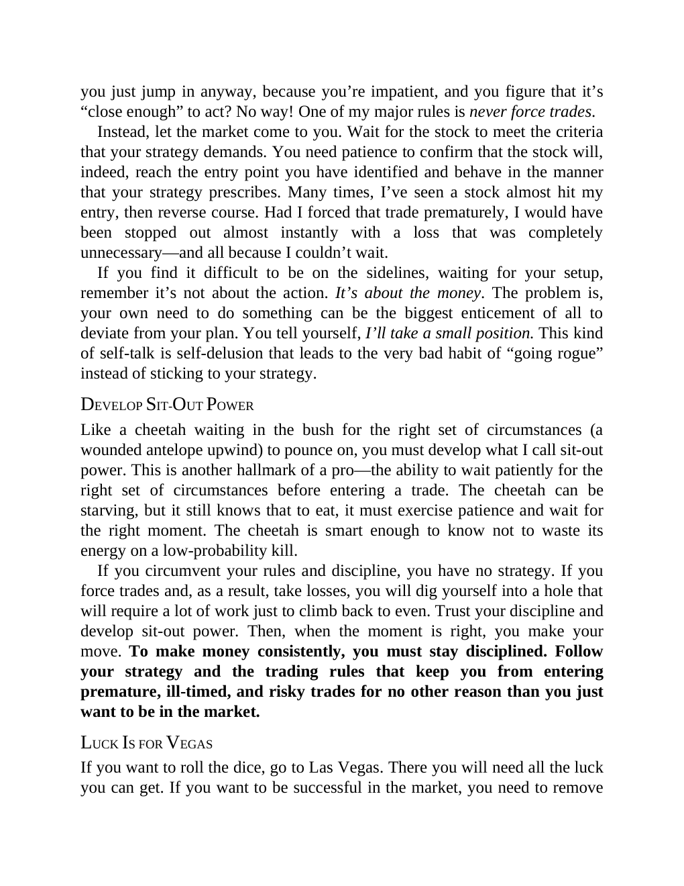

# Think and Trade Like a Champion - Page Image 99

## Source Page

Book: [[Think and Trade Like a Champion]]

## Page Read

Tags: manual-figure-page, risk-first

Concepts: [[Mental Discipline]], [[Risk First]]

This page contains figure language, but the ticker/date was not extractable from the caption text. Treat it as a manual visual case: identify the shape, decide whether it is a buy setup or an avoid/sell lesson, and only promote it to a trade template after a ticker/date can be reconciled.

## Linked Stock Figures

- No extracted stock-figure case on this page.

## Extracted Page Text Signal

you just jump in anyway, because you’re impatient, and you figure that it’s “close enough” to act? No way! One of my major rules is never force trades. Instead, let the market come to you. Wait for the stock to meet the criteria that your strategy demands. You need patience to confirm that the stock will, indeed, reach the entry point you have identified and behave in the manner that your strategy prescribes. Many times, I’ve seen a stock almost hit my entry, then reverse course. Had I forced th...

## Manual Study Prompt

- What visual structure is the page trying to make obvious?
- Is the lesson about buying, avoiding, selling, or managing risk?
- If a ticker is not present, what generic behavior does the image teach?
- If a ticker is present, does the linked OHLCV rebuild confirm the same behavior?
