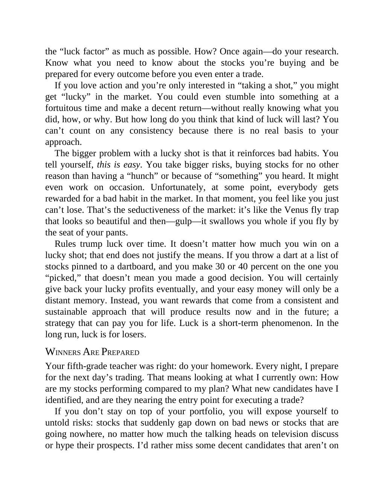

# Think and Trade Like a Champion - Page Image 100

## Source Page

Book: [[Think and Trade Like a Champion]]

## Page Read

Tags: risk-first, text-or-context-page

Concepts: [[Risk First]]

This page is mainly text/context. It is included so the image index has complete source coverage, but it should not be treated as an independent chart pattern.

## Linked Stock Figures

- No extracted stock-figure case on this page.

## Extracted Page Text Signal

the “luck factor” as much as possible. How? Once again-do your research. Know what you need to know about the stocks you’re buying and be prepared for every outcome before you even enter a trade. If you love action and you’re only interested in “taking a shot,” you might get “lucky” in the market. You could even stumble into something at a fortuitous time and make a decent return-without really knowing what you did, how, or why. But how long do you think that kind of luck will last? You can’t co...

## Manual Study Prompt

- What visual structure is the page trying to make obvious?
- Is the lesson about buying, avoiding, selling, or managing risk?
- If a ticker is not present, what generic behavior does the image teach?
- If a ticker is present, does the linked OHLCV rebuild confirm the same behavior?
