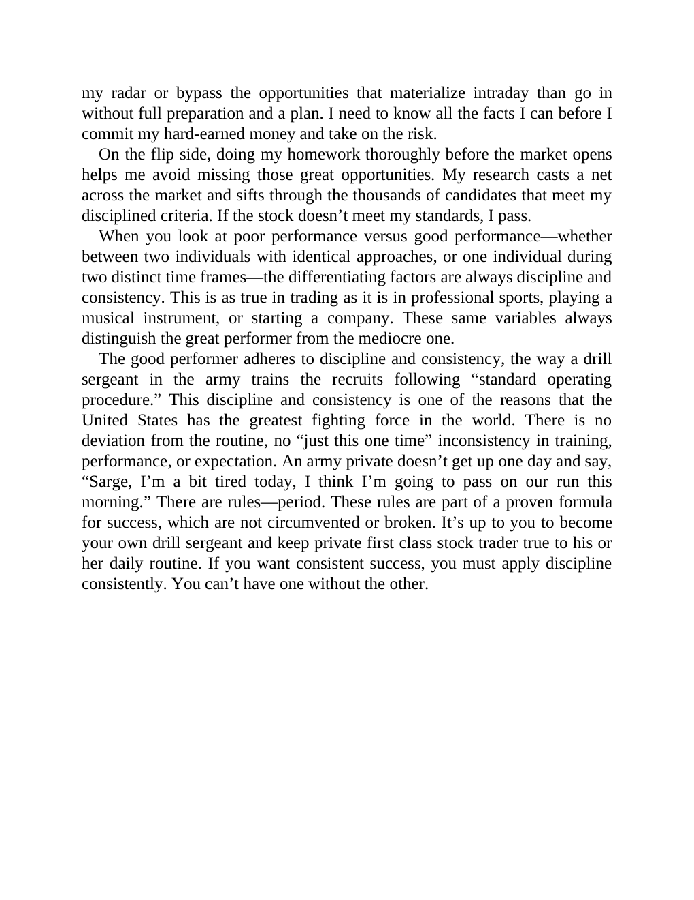

# Think and Trade Like a Champion - Page Image 101

## Source Page

Book: [[Think and Trade Like a Champion]]

## Page Read

Tags: mental-discipline, risk-first, text-or-context-page

Concepts: [[Mental Discipline]], [[Risk First]]

This page is mainly text/context. It is included so the image index has complete source coverage, but it should not be treated as an independent chart pattern.

## Linked Stock Figures

- No extracted stock-figure case on this page.

## Extracted Page Text Signal

my radar or bypass the opportunities that materialize intraday than go in without full preparation and a plan. I need to know all the facts I can before I commit my hard-earned money and take on the risk. On the flip side, doing my homework thoroughly before the market opens helps me avoid missing those great opportunities. My research casts a net across the market and sifts through the thousands of candidates that meet my disciplined criteria. If the stock doesn’t meet my standards, I pass. Whe...

## Manual Study Prompt

- What visual structure is the page trying to make obvious?
- Is the lesson about buying, avoiding, selling, or managing risk?
- If a ticker is not present, what generic behavior does the image teach?
- If a ticker is present, does the linked OHLCV rebuild confirm the same behavior?
