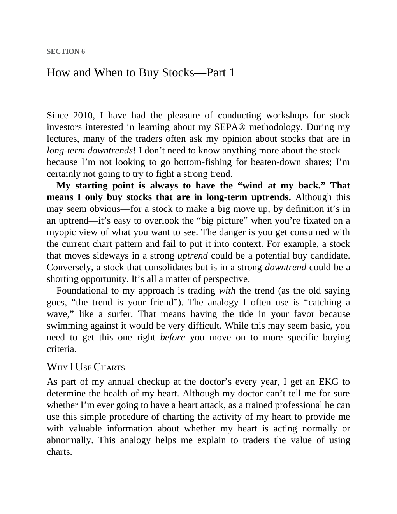

# Think and Trade Like a Champion - Page Image 102

## Source Page

Book: [[Think and Trade Like a Champion]]

## Page Read

Tags: text-or-context-page

Concepts: [[Mental Discipline]]

This page is mainly text/context. It is included so the image index has complete source coverage, but it should not be treated as an independent chart pattern.

## Linked Stock Figures

- No extracted stock-figure case on this page.

## Extracted Page Text Signal

SECTION 6 How and When to Buy Stocks-Part 1 Since 2010, I have had the pleasure of conducting workshops for stock investors interested in learning about my SEPA® methodology. During my lectures, many of the traders often ask my opinion about stocks that are in long-term downtrends! I don’t need to know anything more about the stock- because I’m not looking to go bottom-fishing for beaten-down shares; I’m certainly not going to try to fight a strong trend. My starting point is always to have the ...

## Manual Study Prompt

- What visual structure is the page trying to make obvious?
- Is the lesson about buying, avoiding, selling, or managing risk?
- If a ticker is not present, what generic behavior does the image teach?
- If a ticker is present, does the linked OHLCV rebuild confirm the same behavior?
