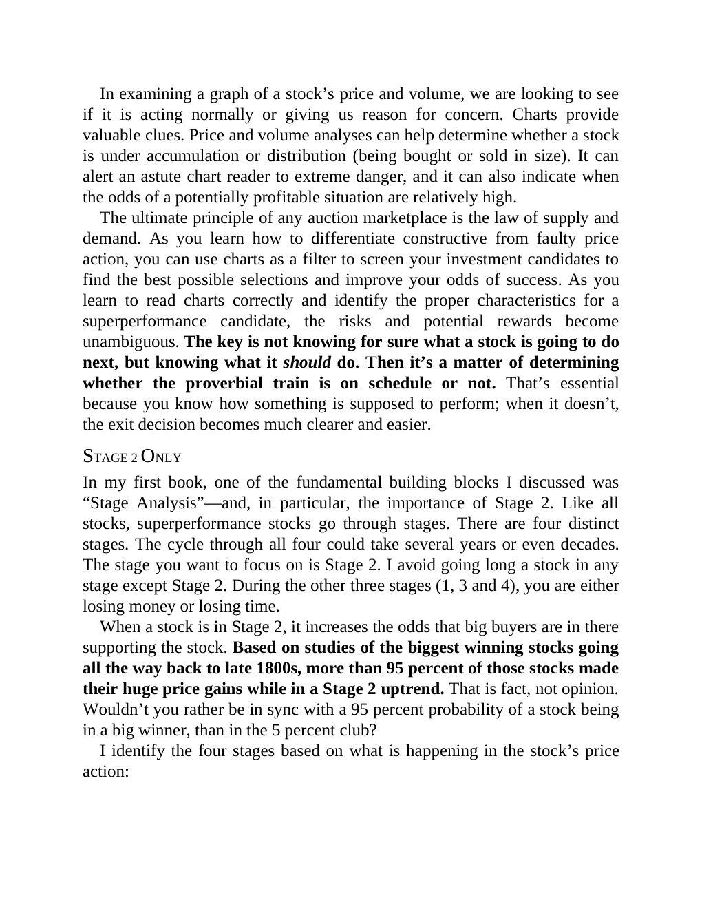

# Think and Trade Like a Champion - Page Image 103

## Source Page

Book: [[Think and Trade Like a Champion]]

## Page Read

Tags: risk-first, stage-2-uptrend, text-or-context-page, volume-behavior

Concepts: [[Risk First]], [[Stage 2 Uptrend]], [[Volume Dry-Up and Accumulation]]

This page is mainly text/context. It is included so the image index has complete source coverage, but it should not be treated as an independent chart pattern.

## Linked Stock Figures

- No extracted stock-figure case on this page.

## Extracted Page Text Signal

In examining a graph of a stock’s price and volume, we are looking to see if it is acting normally or giving us reason for concern. Charts provide valuable clues. Price and volume analyses can help determine whether a stock is under accumulation or distribution (being bought or sold in size). It can alert an astute chart reader to extreme danger, and it can also indicate when the odds of a potentially profitable situation are relatively high. The ultimate principle of any auction marketplace is ...

## Manual Study Prompt

- What visual structure is the page trying to make obvious?
- Is the lesson about buying, avoiding, selling, or managing risk?
- If a ticker is not present, what generic behavior does the image teach?
- If a ticker is present, does the linked OHLCV rebuild confirm the same behavior?
