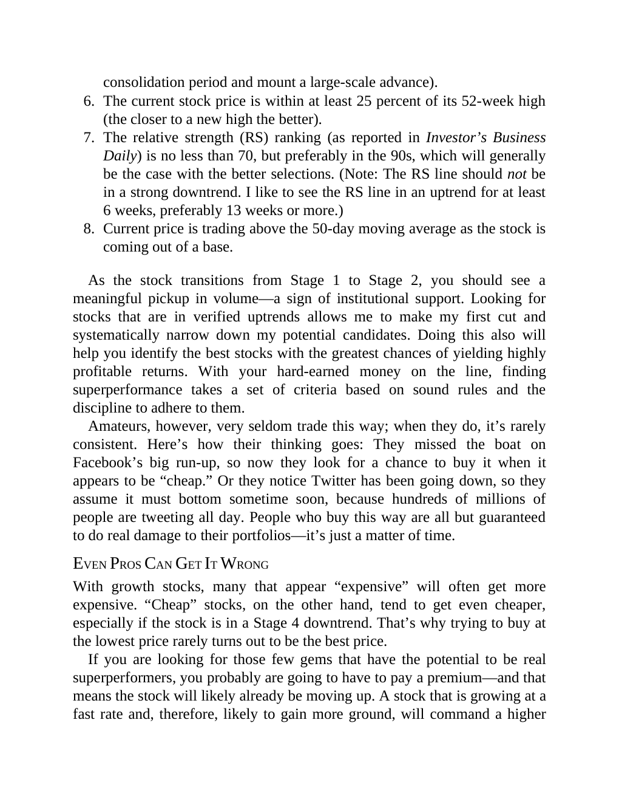

# Think and Trade Like a Champion - Page Image 106

## Source Page

Book: [[Think and Trade Like a Champion]]

## Page Read

Tags: mental-discipline, relative-strength, stage-2-uptrend, text-or-context-page, volume-behavior

Concepts: [[Mental Discipline]], [[Relative Strength Leadership]], [[Stage 2 Uptrend]], [[Volume Dry-Up and Accumulation]]

This page is mainly text/context. It is included so the image index has complete source coverage, but it should not be treated as an independent chart pattern.

## Linked Stock Figures

- No extracted stock-figure case on this page.

## Extracted Page Text Signal

consolidation period and mount a large-scale advance). 6. The current stock price is within at least 25 percent of its 52-week high (the closer to a new high the better). 7. The relative strength (RS) ranking (as reported in Investor’s Business Daily) is no less than 70, but preferably in the 90s, which will generally be the case with the better selections. (Note: The RS line should not be in a strong downtrend. I like to see the RS line in an uptrend for at least 6 weeks, preferably 13 weeks or...

## Manual Study Prompt

- What visual structure is the page trying to make obvious?
- Is the lesson about buying, avoiding, selling, or managing risk?
- If a ticker is not present, what generic behavior does the image teach?
- If a ticker is present, does the linked OHLCV rebuild confirm the same behavior?
