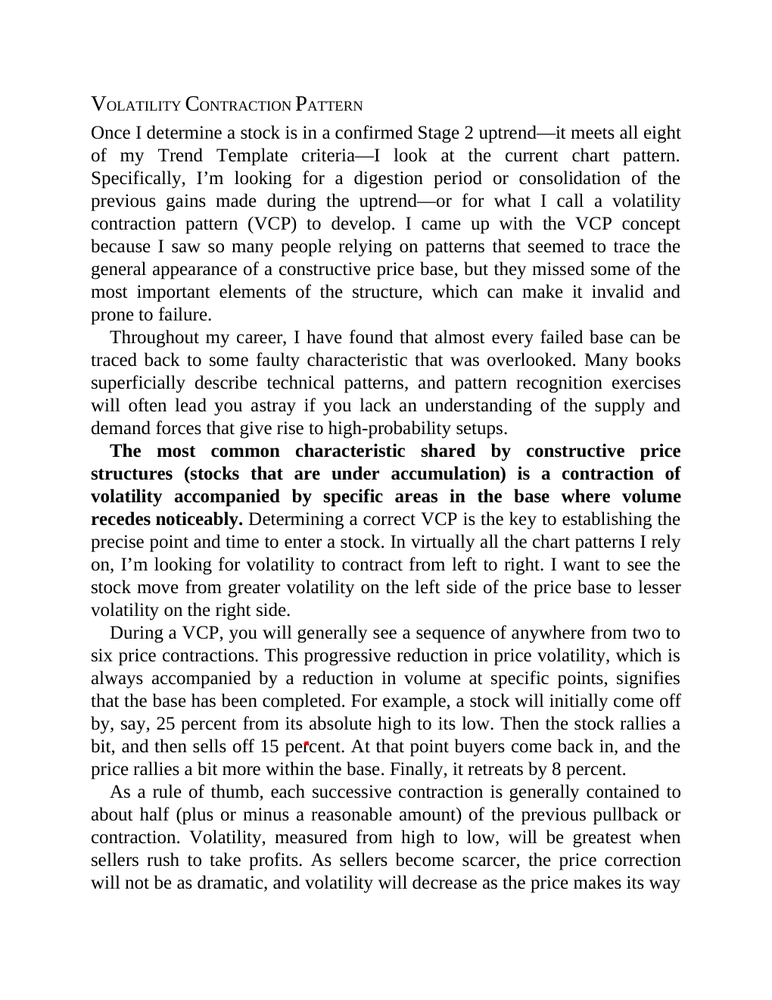

# Think and Trade Like a Champion - Page Image 109

## Source Page

Book: [[Think and Trade Like a Champion]]

## Page Read

Tags: sell-or-failure, stage-2-uptrend, text-or-context-page, trend-template, vcp-or-tightening, volume-behavior

Concepts: [[Sell Rules and Failure Signals]], [[Stage 2 Uptrend]], [[Trend Template]], [[Volatility Contraction Pattern]], [[Volume Dry-Up and Accumulation]]

This page is mainly text/context. It is included so the image index has complete source coverage, but it should not be treated as an independent chart pattern.

## Linked Stock Figures

- No extracted stock-figure case on this page.

## Extracted Page Text Signal

VOLATILITY CONTRACTION PATTERN Once I determine a stock is in a confirmed Stage 2 uptrend-it meets all eight of my Trend Template criteria-I look at the current chart pattern. Specifically, I’m looking for a digestion period or consolidation of the previous gains made during the uptrend-or for what I call a volatility contraction pattern (VCP) to develop. I came up with the VCP concept because I saw so many people relying on patterns that seemed to trace the general appearance of a constructive ...

## Manual Study Prompt

- What visual structure is the page trying to make obvious?
- Is the lesson about buying, avoiding, selling, or managing risk?
- If a ticker is not present, what generic behavior does the image teach?
- If a ticker is present, does the linked OHLCV rebuild confirm the same behavior?
