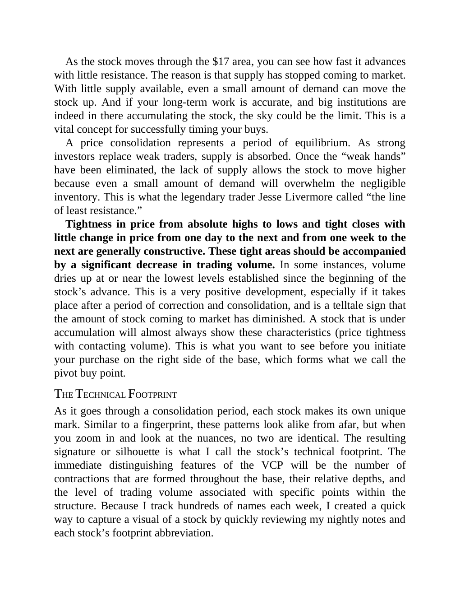

# Think and Trade Like a Champion - Page Image 111

## Source Page

Book: [[Think and Trade Like a Champion]]

## Page Read

Tags: risk-first, text-or-context-page, volume-behavior

Concepts: [[Risk First]], [[Volume Dry-Up and Accumulation]]

This page is mainly text/context. It is included so the image index has complete source coverage, but it should not be treated as an independent chart pattern.

## Linked Stock Figures

- No extracted stock-figure case on this page.

## Extracted Page Text Signal

As the stock moves through the $17 area, you can see how fast it advances with little resistance. The reason is that supply has stopped coming to market. With little supply available, even a small amount of demand can move the stock up. And if your long-term work is accurate, and big institutions are indeed in there accumulating the stock, the sky could be the limit. This is a vital concept for successfully timing your buys. A price consolidation represents a period of equilibrium. As strong inv...

## Manual Study Prompt

- What visual structure is the page trying to make obvious?
- Is the lesson about buying, avoiding, selling, or managing risk?
- If a ticker is not present, what generic behavior does the image teach?
- If a ticker is present, does the linked OHLCV rebuild confirm the same behavior?
