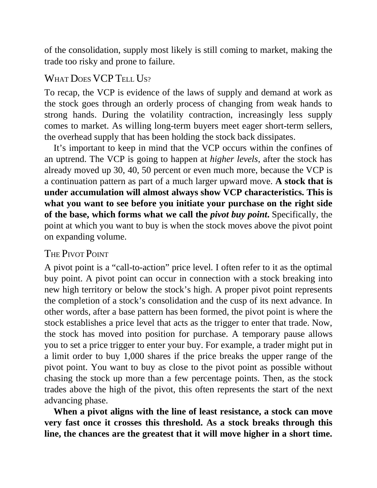

# Think and Trade Like a Champion - Page Image 116

## Source Page

Book: [[Think and Trade Like a Champion]]

## Page Read

Tags: pivot-or-entry, risk-first, sell-or-failure, text-or-context-page, vcp-or-tightening, volume-behavior

Concepts: [[Pivot and Entry]], [[Risk First]], [[Sell Rules and Failure Signals]], [[Volatility Contraction Pattern]], [[Volume Dry-Up and Accumulation]]

This page is mainly text/context. It is included so the image index has complete source coverage, but it should not be treated as an independent chart pattern.

## Linked Stock Figures

- No extracted stock-figure case on this page.

## Extracted Page Text Signal

of the consolidation, supply most likely is still coming to market, making the trade too risky and prone to failure. WHAT DOES VCP TELL US? To recap, the VCP is evidence of the laws of supply and demand at work as the stock goes through an orderly process of changing from weak hands to strong hands. During the volatility contraction, increasingly less supply comes to market. As willing long-term buyers meet eager short-term sellers, the overhead supply that has been holding the stock back dissip...

## Manual Study Prompt

- What visual structure is the page trying to make obvious?
- Is the lesson about buying, avoiding, selling, or managing risk?
- If a ticker is not present, what generic behavior does the image teach?
- If a ticker is present, does the linked OHLCV rebuild confirm the same behavior?
