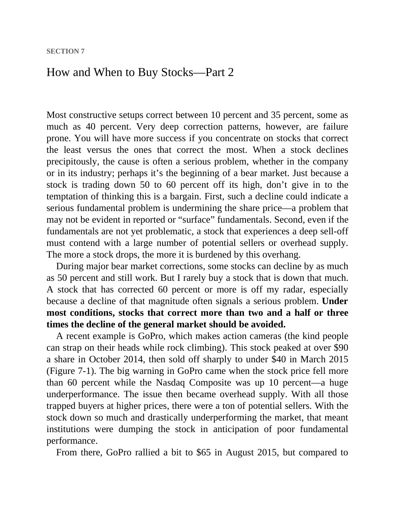

# Think and Trade Like a Champion - Page Image 119

## Source Page

Book: [[Think and Trade Like a Champion]]

## Page Read

Tags: sell-or-failure, text-or-context-page

Concepts: [[Sell Rules and Failure Signals]]

This page is mainly text/context. It is included so the image index has complete source coverage, but it should not be treated as an independent chart pattern.

## Linked Stock Figures

- No extracted stock-figure case on this page.

## Extracted Page Text Signal

SECTION 7 How and When to Buy Stocks-Part 2 Most constructive setups correct between 10 percent and 35 percent, some as much as 40 percent. Very deep correction patterns, however, are failure prone. You will have more success if you concentrate on stocks that correct the least versus the ones that correct the most. When a stock declines precipitously, the cause is often a serious problem, whether in the company or in its industry; perhaps it’s the beginning of a bear market. Just because a stock...

## Manual Study Prompt

- What visual structure is the page trying to make obvious?
- Is the lesson about buying, avoiding, selling, or managing risk?
- If a ticker is not present, what generic behavior does the image teach?
- If a ticker is present, does the linked OHLCV rebuild confirm the same behavior?
