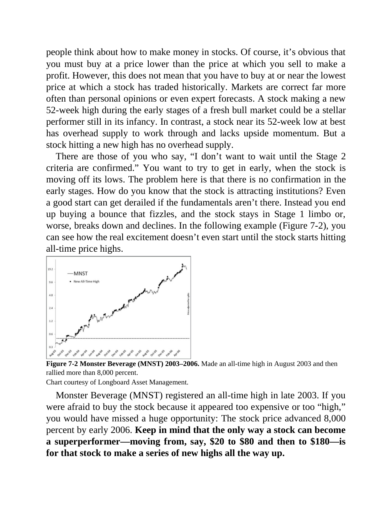

# Think and Trade Like a Champion - Page Image 121

## Source Page

Book: [[Think and Trade Like a Champion]]

## Page Read

Tags: sell-or-failure, stage-2-leadership, stage-2-uptrend, stock-chart-page, vcp-or-tightening

Concepts: [[Pivot and Entry]], [[Relative Strength Leadership]], [[Sell Rules and Failure Signals]], [[Stage 2 Uptrend]], [[Trend Template]], [[Volatility Contraction Pattern]], [[Volume Dry-Up and Accumulation]]

This page contains one or more stock-chart figures already reconciled in the stock-image layer. Study the source page first for the visual lesson, then open the linked case notes to compare it against rebuilt OHLCV data.

## Linked Stock Figures

- [[Think and Trade Like a Champion - Figure 7-2 - MNST - page 121]] - MNST - vcp-or-tightening; stage-2-leadership

## Extracted Page Text Signal

people think about how to make money in stocks. Of course, it’s obvious that you must buy at a price lower than the price at which you sell to make a profit. However, this does not mean that you have to buy at or near the lowest price at which a stock has traded historically. Markets are correct far more often than personal opinions or even expert forecasts. A stock making a new 52-week high during the early stages of a fresh bull market could be a stellar performer still in its infancy. In cont...

## Manual Study Prompt

- What visual structure is the page trying to make obvious?
- Is the lesson about buying, avoiding, selling, or managing risk?
- If a ticker is not present, what generic behavior does the image teach?
- If a ticker is present, does the linked OHLCV rebuild confirm the same behavior?
