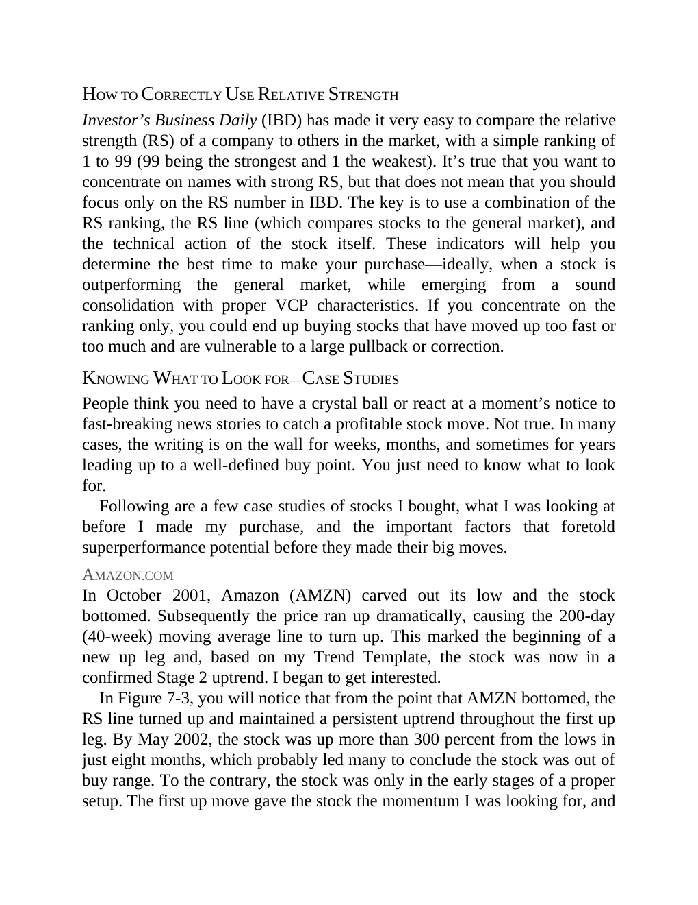

# Think and Trade Like a Champion - Page Image 122

## Source Page

Book: [[Think and Trade Like a Champion]]

## Page Read

Tags: relative-strength, text-or-context-page

Concepts: [[Relative Strength Leadership]]

This page is mainly text/context. It is included so the image index has complete source coverage, but it should not be treated as an independent chart pattern.

## Linked Stock Figures

- No extracted stock-figure case on this page.

## Extracted Page Text Signal

HOW TO CORRECTLY USE RELATIVE STRENGTH Investor’s Business Daily (IBD) has made it very easy to compare the relative strength (RS) of a company to others in the market, with a simple ranking of 1 to 99 (99 being the strongest and 1 the weakest). It’s true that you want to concentrate on names with strong RS, but that does not mean that you should focus only on the RS number in IBD. The key is to use a combination of the RS ranking, the RS line (which compares stocks to the general market), and t...

## Manual Study Prompt

- What visual structure is the page trying to make obvious?
- Is the lesson about buying, avoiding, selling, or managing risk?
- If a ticker is not present, what generic behavior does the image teach?
- If a ticker is present, does the linked OHLCV rebuild confirm the same behavior?
