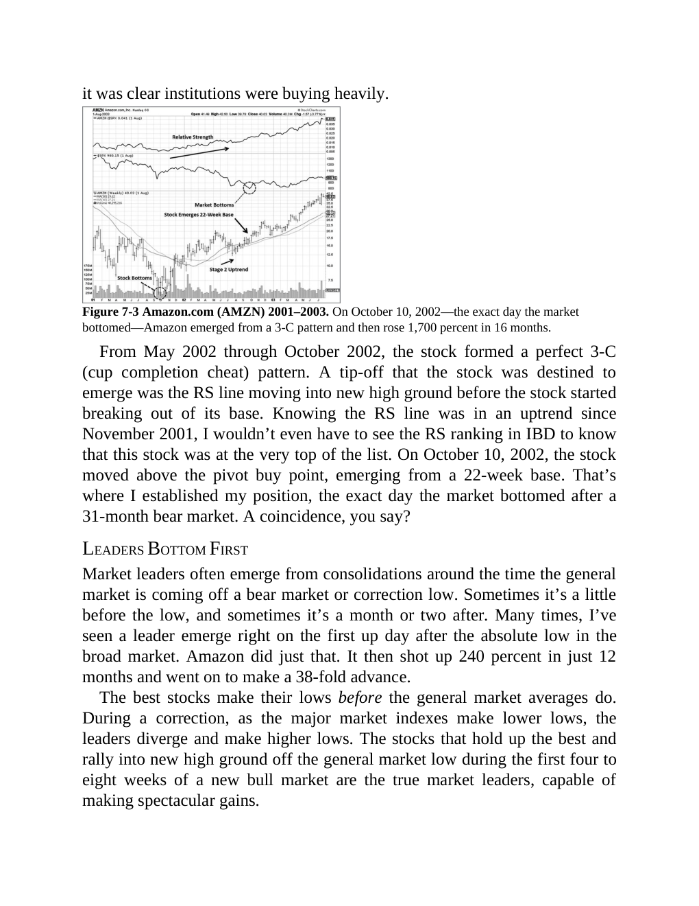

# Think and Trade Like a Champion - Page Image 123

## Source Page

Book: [[Think and Trade Like a Champion]]

## Page Read

Tags: cheat-entry, pivot-breakout, pivot-or-entry, relative-strength-before-price, stock-chart-page, vcp-or-tightening, volume-dry-up

Concepts: [[Pivot and Entry]], [[Relative Strength Leadership]], [[Trend Template]], [[Volatility Contraction Pattern]], [[Volume Dry-Up and Accumulation]]

This page contains one or more stock-chart figures already reconciled in the stock-image layer. Study the source page first for the visual lesson, then open the linked case notes to compare it against rebuilt OHLCV data.

## Linked Stock Figures

- [[Think and Trade Like a Champion - Figure 7-3 - AMZN - page 123]] - AMZN - vcp-or-tightening; pivot-breakout; cheat-entry; volume-dry-up; relative-strength-before-price

## Extracted Page Text Signal

it was clear institutions were buying heavily. Figure 7-3 Amazon.com (AMZN) 2001-2003. On October 10, 2002-the exact day the market bottomed-Amazon emerged from a 3-C pattern and then rose 1,700 percent in 16 months. From May 2002 through October 2002, the stock formed a perfect 3-C (cup completion cheat) pattern. A tip-off that the stock was destined to emerge was the RS line moving into new high ground before the stock started breaking out of its base. Knowing the RS line was in an uptrend sin...

## Manual Study Prompt

- What visual structure is the page trying to make obvious?
- Is the lesson about buying, avoiding, selling, or managing risk?
- If a ticker is not present, what generic behavior does the image teach?
- If a ticker is present, does the linked OHLCV rebuild confirm the same behavior?
