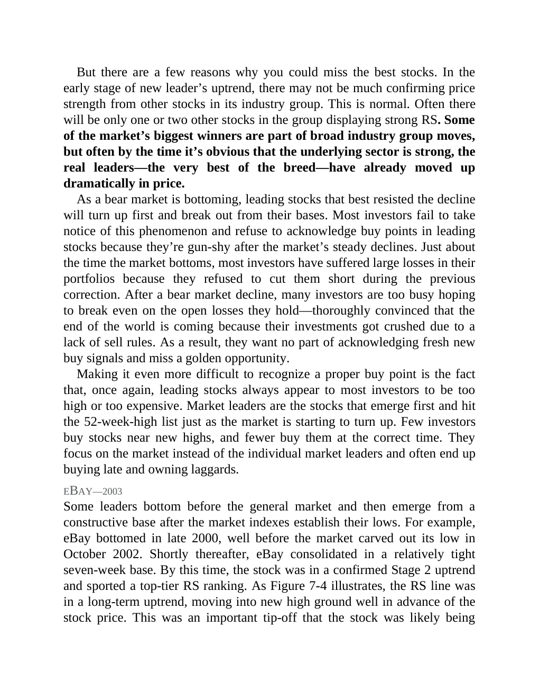

# Think and Trade Like a Champion - Page Image 124

## Source Page

Book: [[Think and Trade Like a Champion]]

## Page Read

Tags: manual-review-needed, sell-or-failure, stock-chart-page

Concepts: [[Mental Discipline]], [[Sell Rules and Failure Signals]]

This page contains one or more stock-chart figures already reconciled in the stock-image layer. Study the source page first for the visual lesson, then open the linked case notes to compare it against rebuilt OHLCV data.

## Linked Stock Figures

- [[Think and Trade Like a Champion - Figure 7-4 - manual-review - page 124]] - manual - manual-review-needed

## Extracted Page Text Signal

But there are a few reasons why you could miss the best stocks. In the early stage of new leader’s uptrend, there may not be much confirming price strength from other stocks in its industry group. This is normal. Often there will be only one or two other stocks in the group displaying strong RS. Some of the market’s biggest winners are part of broad industry group moves, but often by the time it’s obvious that the underlying sector is strong, the real leaders-the very best of the breed-have alre...

## Manual Study Prompt

- What visual structure is the page trying to make obvious?
- Is the lesson about buying, avoiding, selling, or managing risk?
- If a ticker is not present, what generic behavior does the image teach?
- If a ticker is present, does the linked OHLCV rebuild confirm the same behavior?
