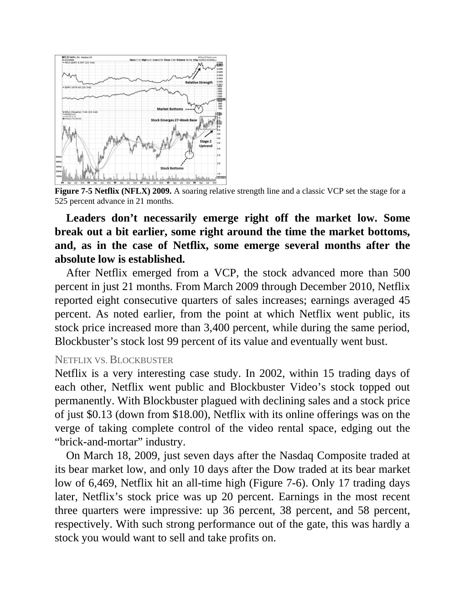

# Think and Trade Like a Champion - Page Image 126

## Source Page

Book: [[Think and Trade Like a Champion]]

## Page Read

Tags: pivot-breakout, relative-strength, relative-strength-before-price, stage-2-leadership, stock-chart-page, vcp-or-tightening

Concepts: [[Pivot and Entry]], [[Relative Strength Leadership]], [[Stage 2 Uptrend]], [[Trend Template]], [[Volatility Contraction Pattern]], [[Volume Dry-Up and Accumulation]]

This page contains one or more stock-chart figures already reconciled in the stock-image layer. Study the source page first for the visual lesson, then open the linked case notes to compare it against rebuilt OHLCV data.

## Linked Stock Figures

- [[Think and Trade Like a Champion - Figure 7-5 - NFLX - page 126]] - NFLX - vcp-or-tightening; pivot-breakout; relative-strength-before-price; stage-2-leadership

## Extracted Page Text Signal

Figure 7-5 Netflix (NFLX) 2009. A soaring relative strength line and a classic VCP set the stage for a 525 percent advance in 21 months. Leaders don’t necessarily emerge right off the market low. Some break out a bit earlier, some right around the time the market bottoms, and, as in the case of Netflix, some emerge several months after the absolute low is established. After Netflix emerged from a VCP, the stock advanced more than 500 percent in just 21 months. From March 2009 through December 20...

## Manual Study Prompt

- What visual structure is the page trying to make obvious?
- Is the lesson about buying, avoiding, selling, or managing risk?
- If a ticker is not present, what generic behavior does the image teach?
- If a ticker is present, does the linked OHLCV rebuild confirm the same behavior?
