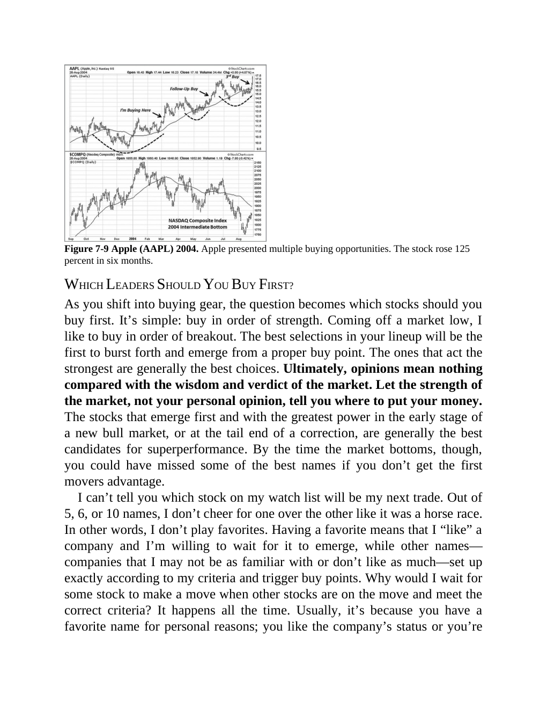

# Think and Trade Like a Champion - Page Image 130

## Source Page

Book: [[Think and Trade Like a Champion]]

## Page Read

Tags: pivot-breakout, pivot-or-entry, stage-2-leadership, stock-chart-page, vcp-or-tightening

Concepts: [[Pivot and Entry]], [[Relative Strength Leadership]], [[Stage 2 Uptrend]], [[Trend Template]], [[Volatility Contraction Pattern]], [[Volume Dry-Up and Accumulation]]

This page contains one or more stock-chart figures already reconciled in the stock-image layer. Study the source page first for the visual lesson, then open the linked case notes to compare it against rebuilt OHLCV data.

## Linked Stock Figures

- [[Think and Trade Like a Champion - Figure 7-9 - AAPL - page 130]] - AAPL - vcp-or-tightening; pivot-breakout; stage-2-leadership

## Extracted Page Text Signal

Figure 7-9 Apple (AAPL) 2004. Apple presented multiple buying opportunities. The stock rose 125 percent in six months. WHICH LEADERS SHOULD YOU BUY FIRST? As you shift into buying gear, the question becomes which stocks should you buy first. It’s simple: buy in order of strength. Coming off a market low, I like to buy in order of breakout. The best selections in your lineup will be the first to burst forth and emerge from a proper buy point. The ones that act the strongest are generally the best...

## Manual Study Prompt

- What visual structure is the page trying to make obvious?
- Is the lesson about buying, avoiding, selling, or managing risk?
- If a ticker is not present, what generic behavior does the image teach?
- If a ticker is present, does the linked OHLCV rebuild confirm the same behavior?
