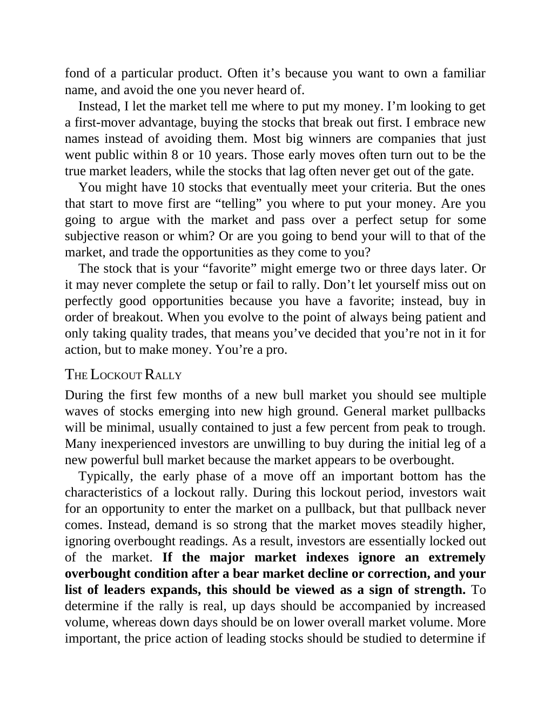

# Think and Trade Like a Champion - Page Image 131

## Source Page

Book: [[Think and Trade Like a Champion]]

## Page Read

Tags: pivot-or-entry, text-or-context-page

Concepts: [[Pivot and Entry]]

This page is mainly text/context. It is included so the image index has complete source coverage, but it should not be treated as an independent chart pattern.

## Linked Stock Figures

- No extracted stock-figure case on this page.

## Extracted Page Text Signal

fond of a particular product. Often it’s because you want to own a familiar name, and avoid the one you never heard of. Instead, I let the market tell me where to put my money. I’m looking to get a first-mover advantage, buying the stocks that break out first. I embrace new names instead of avoiding them. Most big winners are companies that just went public within 8 or 10 years. Those early moves often turn out to be the true market leaders, while the stocks that lag often never get out of the g...

## Manual Study Prompt

- What visual structure is the page trying to make obvious?
- Is the lesson about buying, avoiding, selling, or managing risk?
- If a ticker is not present, what generic behavior does the image teach?
- If a ticker is present, does the linked OHLCV rebuild confirm the same behavior?
