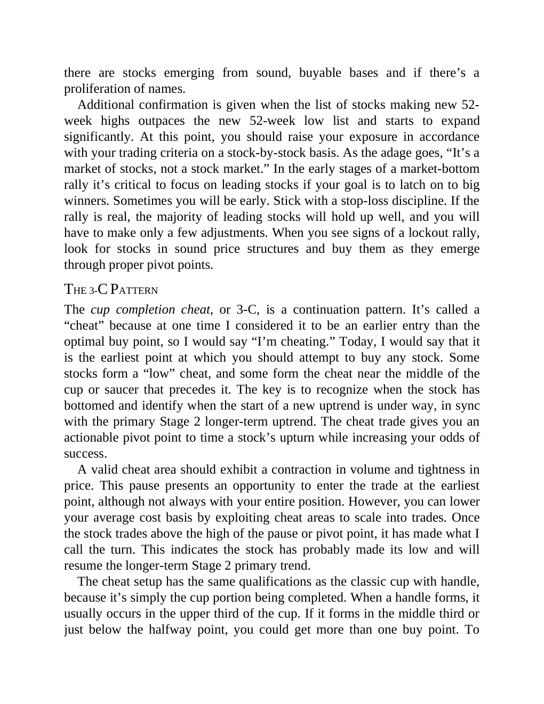

# Think and Trade Like a Champion - Page Image 132

## Source Page

Book: [[Think and Trade Like a Champion]]

## Page Read

Tags: mental-discipline, pivot-or-entry, risk-first, stage-2-uptrend, text-or-context-page

Concepts: [[Mental Discipline]], [[Pivot and Entry]], [[Risk First]], [[Stage 2 Uptrend]]

This page is mainly text/context. It is included so the image index has complete source coverage, but it should not be treated as an independent chart pattern.

## Linked Stock Figures

- No extracted stock-figure case on this page.

## Extracted Page Text Signal

there are stocks emerging from sound, buyable bases and if there’s a proliferation of names. Additional confirmation is given when the list of stocks making new 52- week highs outpaces the new 52-week low list and starts to expand significantly. At this point, you should raise your exposure in accordance with your trading criteria on a stock-by-stock basis. As the adage goes, “It’s a market of stocks, not a stock market.” In the early stages of a market-bottom rally it’s critical to focus on lea...

## Manual Study Prompt

- What visual structure is the page trying to make obvious?
- Is the lesson about buying, avoiding, selling, or managing risk?
- If a ticker is not present, what generic behavior does the image teach?
- If a ticker is present, does the linked OHLCV rebuild confirm the same behavior?
