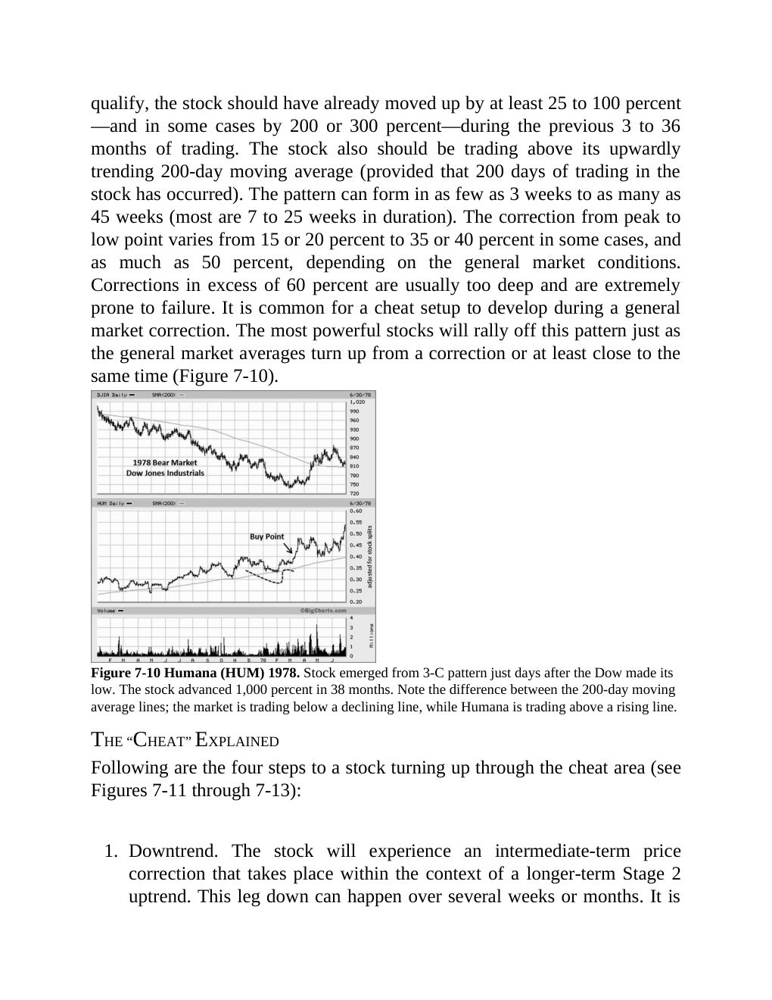

# Think and Trade Like a Champion - Page Image 133

## Source Page

Book: [[Think and Trade Like a Champion]]

## Page Read

Tags: manual-review-needed, sell-or-failure, stage-2-uptrend, stock-chart-page

Concepts: [[Mental Discipline]], [[Sell Rules and Failure Signals]], [[Stage 2 Uptrend]]

This page contains one or more stock-chart figures already reconciled in the stock-image layer. Study the source page first for the visual lesson, then open the linked case notes to compare it against rebuilt OHLCV data.

## Linked Stock Figures

- [[Think and Trade Like a Champion - Figure 7-10 - HUM - page 133]] - HUM - manual-review-needed

## Extracted Page Text Signal

qualify, the stock should have already moved up by at least 25 to 100 percent -and in some cases by 200 or 300 percent-during the previous 3 to 36 months of trading. The stock also should be trading above its upwardly trending 200-day moving average (provided that 200 days of trading in the stock has occurred). The pattern can form in as few as 3 weeks to as many as 45 weeks (most are 7 to 25 weeks in duration). The correction from peak to low point varies from 15 or 20 percent to 35 or 40 perce...

## Manual Study Prompt

- What visual structure is the page trying to make obvious?
- Is the lesson about buying, avoiding, selling, or managing risk?
- If a ticker is not present, what generic behavior does the image teach?
- If a ticker is present, does the linked OHLCV rebuild confirm the same behavior?
