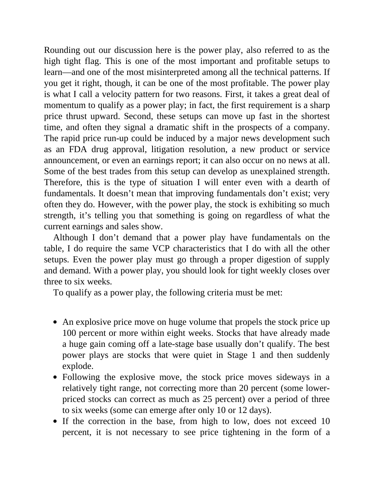

# Think and Trade Like a Champion - Page Image 140

## Source Page

Book: [[Think and Trade Like a Champion]]

## Page Read

Tags: text-or-context-page

Concepts: [[Mental Discipline]]

This page is mainly text/context. It is included so the image index has complete source coverage, but it should not be treated as an independent chart pattern.

## Linked Stock Figures

- No extracted stock-figure case on this page.

## Extracted Page Text Signal

Rounding out our discussion here is the power play, also referred to as the high tight flag. This is one of the most important and profitable setups to learn-and one of the most misinterpreted among all the technical patterns. If you get it right, though, it can be one of the most profitable. The power play is what I call a velocity pattern for two reasons. First, it takes a great deal of momentum to qualify as a power play; in fact, the first requirement is a sharp price thrust upward. Second, ...

## Manual Study Prompt

- What visual structure is the page trying to make obvious?
- Is the lesson about buying, avoiding, selling, or managing risk?
- If a ticker is not present, what generic behavior does the image teach?
- If a ticker is present, does the linked OHLCV rebuild confirm the same behavior?
