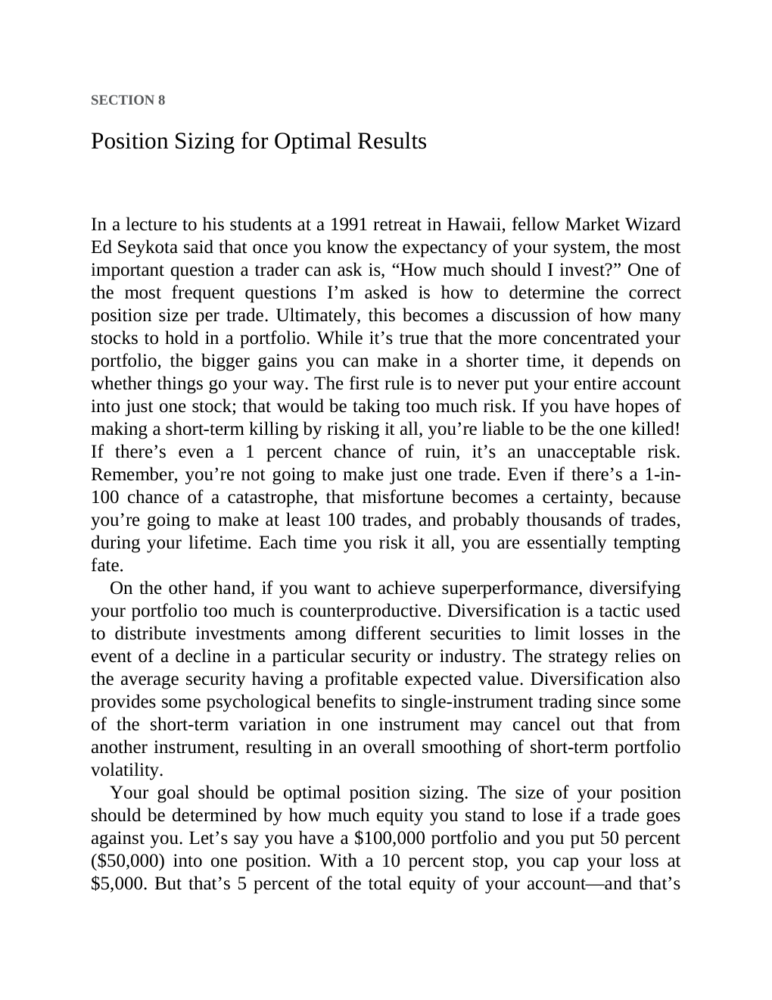

# Think and Trade Like a Champion - Page Image 142

## Source Page

Book: [[Think and Trade Like a Champion]]

## Page Read

Tags: risk-first, text-or-context-page

Concepts: [[Risk First]]

This page is mainly text/context. It is included so the image index has complete source coverage, but it should not be treated as an independent chart pattern.

## Linked Stock Figures

- No extracted stock-figure case on this page.

## Extracted Page Text Signal

SECTION 8 Position Sizing for Optimal Results In a lecture to his students at a 1991 retreat in Hawaii, fellow Market Wizard Ed Seykota said that once you know the expectancy of your system, the most important question a trader can ask is, “How much should I invest?” One of the most frequent questions I’m asked is how to determine the correct position size per trade. Ultimately, this becomes a discussion of how many stocks to hold in a portfolio. While it’s true that the more concentrated your p...

## Manual Study Prompt

- What visual structure is the page trying to make obvious?
- Is the lesson about buying, avoiding, selling, or managing risk?
- If a ticker is not present, what generic behavior does the image teach?
- If a ticker is present, does the linked OHLCV rebuild confirm the same behavior?
