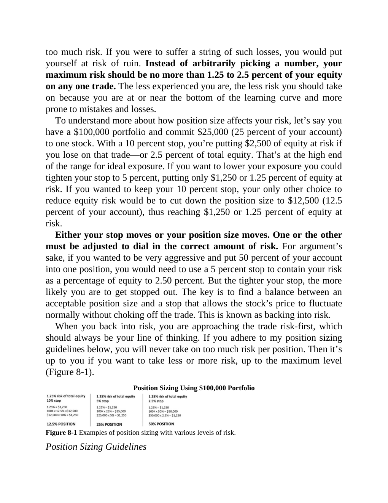

# Think and Trade Like a Champion - Page Image 143

## Source Page

Book: [[Think and Trade Like a Champion]]

## Page Read

Tags: manual-review-needed, mental-discipline, risk-first, stock-chart-page

Concepts: [[Mental Discipline]], [[Risk First]]

This page contains one or more stock-chart figures already reconciled in the stock-image layer. Study the source page first for the visual lesson, then open the linked case notes to compare it against rebuilt OHLCV data.

## Linked Stock Figures

- [[Think and Trade Like a Champion - Figure 8-1 - manual-review - page 143]] - manual - manual-review-needed

## Extracted Page Text Signal

too much risk. If you were to suffer a string of such losses, you would put yourself at risk of ruin. Instead of arbitrarily picking a number, your maximum risk should be no more than 1.25 to 2.5 percent of your equity on any one trade. The less experienced you are, the less risk you should take on because you are at or near the bottom of the learning curve and more prone to mistakes and losses. To understand more about how position size affects your risk, let’s say you have a $100,000 portfolio...

## Manual Study Prompt

- What visual structure is the page trying to make obvious?
- Is the lesson about buying, avoiding, selling, or managing risk?
- If a ticker is not present, what generic behavior does the image teach?
- If a ticker is present, does the linked OHLCV rebuild confirm the same behavior?
