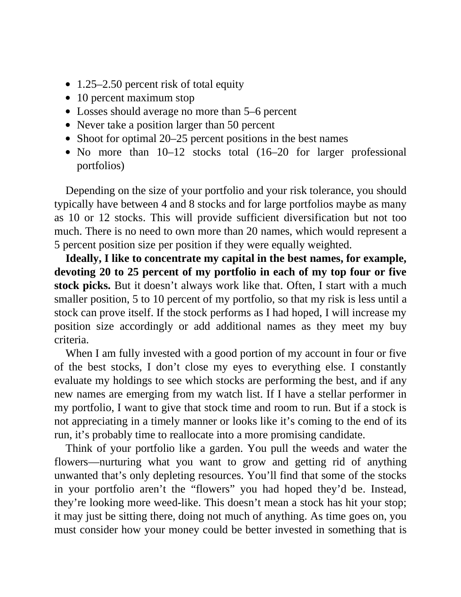

# Think and Trade Like a Champion - Page Image 144

## Source Page

Book: [[Think and Trade Like a Champion]]

## Page Read

Tags: risk-first, text-or-context-page

Concepts: [[Risk First]]

This page is mainly text/context. It is included so the image index has complete source coverage, but it should not be treated as an independent chart pattern.

## Linked Stock Figures

- No extracted stock-figure case on this page.

## Extracted Page Text Signal

1.25-2.50 percent risk of total equity 10 percent maximum stop Losses should average no more than 5-6 percent Never take a position larger than 50 percent Shoot for optimal 20-25 percent positions in the best names No more than 10-12 stocks total (16-20 for larger professional portfolios) Depending on the size of your portfolio and your risk tolerance, you should typically have between 4 and 8 stocks and for large portfolios maybe as many as 10 or 12 stocks. This will provide sufficient diversif...

## Manual Study Prompt

- What visual structure is the page trying to make obvious?
- Is the lesson about buying, avoiding, selling, or managing risk?
- If a ticker is not present, what generic behavior does the image teach?
- If a ticker is present, does the linked OHLCV rebuild confirm the same behavior?
