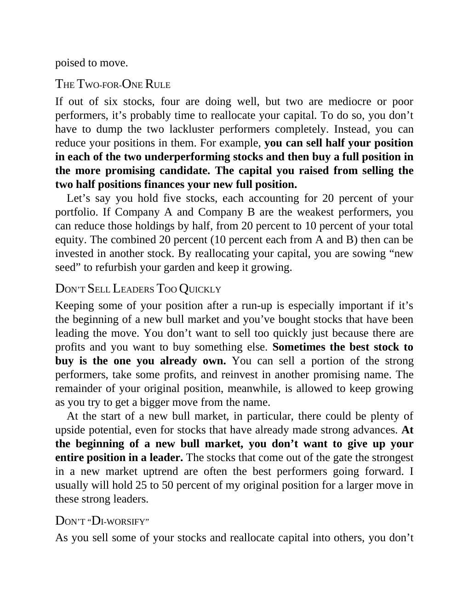

# Think and Trade Like a Champion - Page Image 145

## Source Page

Book: [[Think and Trade Like a Champion]]

## Page Read

Tags: sell-or-failure, text-or-context-page

Concepts: [[Sell Rules and Failure Signals]]

This page is mainly text/context. It is included so the image index has complete source coverage, but it should not be treated as an independent chart pattern.

## Linked Stock Figures

- No extracted stock-figure case on this page.

## Extracted Page Text Signal

poised to move. THE TWO-FOR-ONE RULE If out of six stocks, four are doing well, but two are mediocre or poor performers, it’s probably time to reallocate your capital. To do so, you don’t have to dump the two lackluster performers completely. Instead, you can reduce your positions in them. For example, you can sell half your position in each of the two underperforming stocks and then buy a full position in the more promising candidate. The capital you raised from selling the two half positions f...

## Manual Study Prompt

- What visual structure is the page trying to make obvious?
- Is the lesson about buying, avoiding, selling, or managing risk?
- If a ticker is not present, what generic behavior does the image teach?
- If a ticker is present, does the linked OHLCV rebuild confirm the same behavior?
